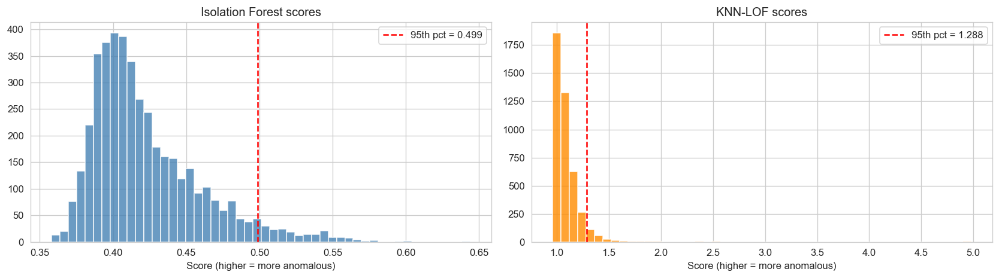
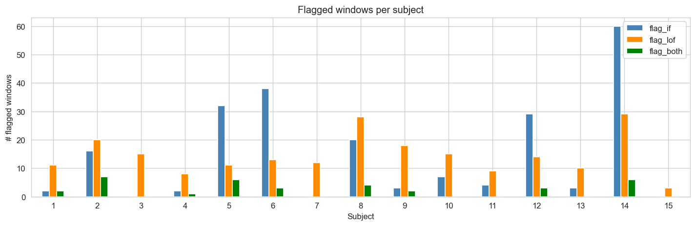
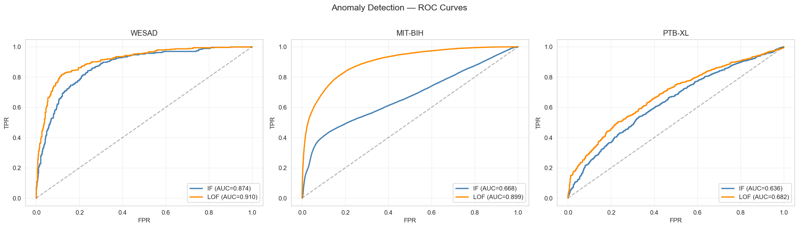

# 1 Introduction

Wearable and ambulatory sensors now stream clinical-grade biosignals: photoplethysmography (PPG), electrocardiography (ECG), electrodermal activity (EDA), skin temperature, and respiration, at home and in hospital [@reiss2019deepppg; @schmidt2018wesad; @goldberger2000physionet]. A single 24-hour multi-channel recording can exceed 10^8 samples. Human review of this volume is impossible, so first-pass screening is necessarily delegated to automated detectors.

Automated screening, however, produces an explanation gap. A conventional alert reduces a possibly complex physiological event to a single number or a red flag. It says that something looks unusual, but not what physiological process may be disturbed or what the relevant clinical guideline recommends. Unexplained alerts are hard to trust and are a documented driver of alert fatigue in continuous monitoring.

Large language models appear to close this gap: they can phrase a detection in plain language a nurse could act on. But raw LLMs hallucinate. They fabricate facts and citations, and they state medical conclusions with unwarranted confidence. Placing an unconstrained LLM behind a clinical alert merely converts an opaque alert into a fluent, unverified one. Retrieval-augmented generation (RAG) [@lewis2020rag] addresses this by forcing the model to answer only from retrieved source documents and to cite them, a pattern shown to eliminate fabricated citations even on small local models in a policy-support setting [@turja2026forecasting].

What is missing is the integration itself. Unsupervised biosignal anomaly detection is a mature field; clinical RAG is a fast-growing one. Yet, to our knowledge (literature search, August 2026), no published system connects them: a detected biosignal anomaly automatically triggering retrieval and grounded explanation, with evaluation of both detection quality and explanation faithfulness. The two closest lines of work each cover only one half, either wearable anomaly detectors without LLM explanation or LLM reporting systems without a true detection stage.

This paper fills that middle ground. Our system watches continuous biosignals, flags statistically unusual 30-second windows with two unsupervised detectors, converts each flag into a deviation-aware natural-language query, retrieves from a 204-document two-tier medical corpus, and generates a structured, cited explanation with a tightly constrained local LLM (Figure 1).

**Contributions.**

1. An alert-triggered RAG pipeline for wearable biosignals. To our knowledge this is the first published system integrating unsupervised anomaly detection, alert-triggered retrieval, and grounded LLM explanation in one continuously running system, with all inference local to the device.
2. A detection evaluation on four datasets, spanning unlabeled in-the-wild wearables (PPG-DaLiA), lab stress with ground truth (WESAD), and clinical pathology at beat level (MIT-BIH) and at scale (PTB-XL), under a train-on-normal protocol. The evaluation includes a dataset audit that identified two globally dead sensor channels.
3. Deviation-aware query construction with source-diverse retrieval. Anomaly context (top-2 z-scored deviating channels, direction, detector consensus) steers retrieval into semantically matched corpus neighborhoods, raising the number of distinct corpus documents actually used from about 11 with naive templated queries to 53 across 398 alerts, with a top-source context share of 11.8%.
4. A dual-family judge evaluation for clinical-alert faithfulness: an objective programmatic citation check (1,359 of 1,359 citations valid) plus two judges from different model families, both reporting zero hallucination verdicts and 100% within-1 agreement. We report the constant-rater degeneracy of Cohen's κ [@cohen1960kappa] explicitly rather than quoting a misleading value.
5. A citation canonicalization step that repairs near-miss PMC identifiers (digit transpositions) at generation time, improving raw citation accuracy from 99.3% to 100%.

The remainder of the paper describes related work (§2), materials and methods (§3), results (§4), discussion (§5), limitations (§6), ethical considerations (§7), and conclusions (§8).

# 2 Related Work

**Unsupervised biosignal anomaly detection.** Isolation Forest (IF) [@liu2008isolationforest] isolates anomalies through recursive random partitioning and is sensitive to subtle, distributed deviations; Local Outlier Factor (LOF) [@breunig2000lof] compares local point density to that of neighbors and is sensitive to sharp, isolated spikes. Both are widely used on ECG and PPG streams, and both are available in scikit-learn [@pedregosa2011scikitlearn]. Beat-level anomaly detection on MIT-BIH with AAMI-style groupings is a canonical benchmark [@moody2001mitbih], and large benchmark suites on PTB-XL have established stratified patient-level fold conventions [@wagner2020ptbxl]. Our detection design runs IF and LOF jointly on a train-on-normal protocol and quantifies their disagreement with Jaccard overlap, extending the methodology of our prior wearable foot-sensor study [@turja2026unsupervised] to cardiac and stress biosignals.

**Wearable stress and affect detection.** WESAD [@schmidt2018wesad] is the standard lab-protocol benchmark for wearable stress detection, recorded with the same chest+wrist hardware as PPG-DaLiA [@reiss2019deepppg], which permits a shared feature pipeline across the two corpora. Prior WESAD work overwhelmingly addresses supervised stress classification; our usage is different: stress labels serve only as evaluation ground truth for an unsupervised detector trained on baseline physiology.

**Retrieval-augmented generation and hallucination suppression.** RAG grounds generation in retrieved documents [@lewis2020rag]; dense retrieval with sentence embeddings [@reimers2019sbert] and distilled encoders such as MiniLM [@wang2020minilm] make local semantic search practical. In biomedical and policy domains, strict answer-only-from-context prompting with mandatory citations has been reported to eliminate fabricated citations on small local models [@turja2026forecasting]. The present system reuses that architecture (ChromaDB vector store [@chromadb2023], local Ollama inference [@ollama2023]) and points it at cardiology guidelines and wearable-sensing literature instead of WHO policy documents.

**LLM-as-judge evaluation.** Automated rubric judging with LLMs is established for open-ended generation [@zheng2023llmjudge]. For grounded clinical alerts, however, there is no standard faithfulness rubric. We use two judges from different model families, each scoring faithfulness, relevance, and completeness on a 1–3 scale, cross-checked by a fully objective programmatic citation audit, and we report the Cohen's κ degeneracy [@cohen1960kappa] that arises when one judge is a constant rater.

# 3 Materials and Methods

## 3.1 System overview

The system is a five-stage pipeline (Figure 1): (1) signal ingestion from chest and wrist sensors; (2) windowing and feature extraction; (3) unsupervised anomaly detection with two models; (4) alert-triggered, deviation-aware retrieval over a two-tier medical corpus; (5) grounded explanation generation with citation canonicalization. Stages 1–3 run continuously; stages 4–5 fire only when a window is flagged, so the expensive LLM path is exercised only by detected anomalies.

```
┌─────────────┐    ┌────────────────┐    ┌────────────────┐    ┌──────────────┐    ┌──────────────────┐
│ 1. Stream   │───▶│ 2. Window +   │───▶│ 3. Anomaly     │───▶│ 4. Deviation-│───▶│ 5. Grounded      │
│ raw signals │    │ featurize     │    │ detection      │    │ aware RAG    │    │ alert + cited    │
│ PPG ECG EDA │    │ 30 s windows, │    │ IF + KNN-LOF   │    │ retrieval    │    │ explanation      │
│ TEMP RESP   │    │ 12 feats/ch   │    │ (train-normal) │    │ (ChromaDB + │    │ (local Qwen3.5   │
│             │    │               │    │                │    │ MiniLM)     │    │ 9B via Ollama)   │
└─────────────┘    └────────────────┘    └────────────────┘    └──────────────┘    └──────────────────┘
```
*Figure 1: System pipeline. Stages 4–5 are alert-triggered: the LLM is invoked only for windows flagged in stage 3. (Diagram to be redrawn in TikZ for the LaTeX build.)*

## 3.2 Signal datasets

Four public datasets are used (Table 1). Together they cover the two failure modes a reviewer would probe: in-the-wild noisy wearables without labels, and clinical pathology with expert labels.

**PPG-DaLiA** [@reiss2019deepppg; @ppgdalia2023] provides continuous chest (RespiBAN, 700 Hz: ECG, respiration, EDA, temperature) and wrist (Empatica E4: BVP 64 Hz, EDA 4 Hz, TEMP 4 Hz) recordings from 15 subjects performing daily activities. It is the pipeline-demonstration corpus and the source of all RAG handoff alerts. An audit across all 15 subjects found the **chest EDA and chest temperature channels constant (dead) in every subject**, a flaw of the released dataset rather than of individual recordings, so both were excluded globally. Five channels remain: chest ECG, chest respiration, wrist BVP (PPG), wrist EDA, and wrist temperature. PPG-DaLiA contains normal activity only (no labeled pathology), so it cannot by itself measure detection accuracy; that is what the labeled datasets below are for.

**WESAD** [@schmidt2018wesad; @wesad2023] contains 15 subjects (S2–S17, missing S1/S12) in a controlled protocol with expert-annotated states: baseline, stress, amusement (plus transient/other). It uses the same hardware as PPG-DaLiA, so the identical loader, cleaner, and featurizer apply. Labels are used only for evaluation: the detectors are trained on baseline windows and scored on their ability to separate stress (anomaly) from baseline+amusement (normal).

**MIT-BIH Arrhythmia Database** [@moody2001mitbih; @mitbih2023] provides 48 half-hour two-channel ambulatory ECG records (360 Hz) with beat-level expert annotations, read via the wfdb stack [@goldberger2000physionet]. It supplies true clinical pathology at beat granularity.

**PTB-XL** [@wagner2020ptbxl] provides 21,799 clinical 12-lead, 10-second ECGs from ~18,869 patients with diagnostic superclass labels and a ready-made patient-stratified 10-fold split (`strat_fold`), of which we use folds 1–8 for training, 9 for validation, and 10 for testing per convention.

*Table 1: Signal datasets.*

| Dataset | Subjects / records | Hardware / leads | Labels | Role in this paper |
|---|---|---|---|---|
| PPG-DaLiA | 15 subjects | RespiBAN chest + Empatica E4 wrist | none (activity only) | in-the-wild detection + all 398 RAG alerts |
| WESAD | 15 subjects | same as PPG-DaLiA | baseline / stress / amusement | detection evaluation vs stress ground truth |
| MIT-BIH | 48 records | 2-lead ambulatory ECG | beat-level (AAMI) | clinical pathology, beat level |
| PTB-XL | 21,799 ECGs | 12-lead clinical ECG | 5 diagnostic superclasses | clinical pathology, scale, stratified folds |

## 3.3 Preprocessing, windowing, and features

Signals are cleaned per channel (non-finite values to NaN; short gaps linearly interpolated; constant channels dropped per the audit above). Streams are segmented into non-overlapping 30-second windows at each channel's native sampling rate. Every window is summarized by 12 statistics: mean, standard deviation, minimum, maximum, peak-to-peak, median, skewness, kurtosis, 25th and 75th percentiles, up-crossing ratio, and RMS roughness. For the five wearable channels this yields a 60-dimensional feature vector (5 × 12). The feature set is deliberately simple and classifier-agnostic; it mirrors the summary-statistic engineering of [@turja2026unsupervised].

For MIT-BIH, fixed-length 0.8 s beat segments (±144 samples around each annotated R-peak, lead MLII) replace the 30 s windows; beats annotated with symbols in the AAMI normal set {N, L, R, e} are labeled normal and all other beat symbols anomalous. For PTB-XL, each 10 s recording (lead I, 100 Hz records) is one feature vector, labeled normal iff its superclass set is exactly {NORM}; records with no resolvable superclass are dropped (21,799 → 21,388 usable).

## 3.4 Anomaly detectors and training protocol

Two unsupervised detectors are used, both from scikit-learn [@pedregosa2011scikitlearn]:

- Isolation Forest (100 trees), which flags points that are easy to isolate by random splits; it is sensitive to subtle, distributed drift.
- KNN-LOF (k = 20, novelty mode), which flags points in locally sparse regions; it is sensitive to abrupt, extreme spikes.

All features are standardized with a scaler fit on the training (normal) partition only. The protocol is train on normal, evaluate on everything. WESAD: train on the 586 baseline windows, evaluate on the 1,106 baseline/stress/amusement windows (stress = positive). MIT-BIH: train on the 90,097 normal beats of the DS1 records, evaluate on all 111,305 beats. PTB-XL: train on the 7,243 normal ECGs of folds 1–8, evaluate on the 2,158 fold-10 ECGs. PPG-DaLiA (unlabeled) is scored jointly over all 15 subjects (4,308 windows) with 5% contamination to produce the alert stream. Decision thresholds sit at the 95th percentile of scores for PPG-DaLiA (5% flag rate), the 85th percentile for WESAD and MIT-BIH (15% flag rate), and the 43rd percentile for PTB-XL (57% flag rate, matching test-set pathology prevalence). We did no hyperparameter tuning; these are baseline settings.

## 3.5 RAG knowledge corpus

The retrieval corpus is two-tiered (Tables 2–3). Society guidelines anchor it clinically; open-access articles cover the wearable and PPG topics the guidelines leave out.

*Table 2: Tier-1: clinical practice guidelines (PDF, full text).*

| Guideline | Society / Year | Ref. |
|---|---|---|
| Evaluation and Management of Patients with Syncope | ACC/AHA/HRS 2017 | [@shen2017syncope] |
| Management of Ventricular Arrhythmias and Sudden Cardiac Death Prevention | AHA/ACC/HRS 2017/2018 | [@alkhatib2017vascd] |
| Diagnosis and Management of Syncope | ESC 2018 | [@brignole2018syncope] |
| Management of Ventricular Arrhythmias and Sudden Cardiac Death | ESC 2022 | [@zeppenfeld2022vascd] |

*Table 3: Tier-2: open-access literature by bucket (Europe PMC, 2025–2026).*

| Bucket | Articles | Covers |
|---|---|---|
| 01 PPG arrhythmia detection | 50 | AF / arrhythmia detection from PPG |
| 02 PPG signal quality & artifacts | 25 | motion artifacts, false-alarm causes |
| 03 ECG anomaly / arrhythmia ML | 45 | clinical ECG detection (deep/ML) |
| 04 Wearable stress / affect detection | 35 | stress detection from EDA/ECG |
| 05 Continuous / ambulatory monitoring | 25 | deployment context |
| 06 Biosignal anomaly-detection methods | 20 | unsupervised / IF methods |

Tier-1 contributes ~305,000 words; Tier-2 contributes 200 articles (~1.78 M words; median ~8,450 words/article), all open access (149 CC BY, 51 CC BY-NC/NC-ND), with generated BibTeX and manifest (title 200/200, journal 200/200, authors 191/200, DOI 184/200). The 204 documents are split into 4,732 chunks (679 Tier-1 + 4,053 Tier-2) of 500 words with 50-word overlap (mean chunk length 489 words).

## 3.6 Embedding and retrieval

Chunks are embedded with `all-MiniLM-L6-v2` (384-dim) [@reimers2019sbert; @wang2020minilm] and stored in a persistent local ChromaDB collection [@chromadb2023]. Retrieval is dense cosine search with a source-diversity constraint: a candidate pool of 20 chunks is fetched, then at most 1 chunk per source document is admitted greedily by distance until the top-5 context is filled. Without this constraint, template-style alert queries let one or two dominant papers occupy every context slot; with it, the 5 retrieved documents per alert come from five distinct sources unless the pool is exhausted.

## 3.7 Deviation-aware query construction

Each flagged window is converted to a natural-language query in three parts. First, the anomaly character: windows flagged by both detectors open with "robust anomaly confirmed by two independent detectors", IF-only windows with "subtle distributed anomaly, gradual drift from baseline", and LOF-only windows with "abrupt isolated spike". Second, the top-2 deviating channels: per-channel mean z-scores are computed across all flagged windows, and the two channels with the largest |z| are named with direction ("elevated/reduced"), their z-score, and window mean. Third, topic keyword phrases for exactly those two channels (e.g., EDA → "electrodermal activity skin conductance sympathetic stress arousal sweat response"), which steer the dense retriever into the semantically corresponding corpus bucket, plus the remaining channel means for context. This construction is the mechanism behind the retrieval-diversity results in §4.4: identical templated queries had collapsed retrieval to ~11 unique corpus documents across all alerts, while deviation-aware queries raise this to 53.

## 3.8 Grounded generation with citation canonicalization

Generation uses Qwen3.5 9B (Q4) served locally by Ollama [@ollama2023; @qwen2025qwen3], with no cloud API and no data egress, at temperature 0.1 with thinking mode disabled and a 10k-token context. The system prompt imposes strict rules: answer only from the provided context; cite the source for every clinical claim; if context is insufficient, say so verbatim; never invent facts, numbers, or citations; state the research-tool disclaimer; keep the answer under 150 words in plain language. The required output format is a fixed four-field structure, DETECTED / EVIDENCE / RECOMMENDATION / DISCLAIMER, which makes the outputs machine-parseable for evaluation.

Because small LLMs occasionally transpose digits in PMC identifiers, every generated explanation is passed through a citation canonicalizer before use: each `[PMC…]` bracket is matched against the retrieved source set; valid IDs are kept; near-miss IDs (edit-distance ≥ 0.75 similarity) are snapped to the closest retrieved ID; unresolvable brackets are dropped. This raised citation accuracy from 99.3% (9 affected rows, near-miss IDs only) to a clean 100% before any judging.

## 3.9 Evaluation protocol

**Detection.** AUC (score-level), plus precision, recall, and F1 at the fixed flag-rate thresholds of §3.4 against WESAD stress, MIT-BIH beat labels, and PTB-XL fold-10 labels. Inter-detector agreement on PPG-DaLiA is quantified with the Jaccard index over flagged-window sets, as in [@turja2026unsupervised].

**Citation accuracy (objective).** A programmatic checker extracts every bracketed citation from each explanation and verifies it against that alert's retrieved source list; totals across all 398 alerts are reported. This check is deterministic and independent of any LLM.

**Dual LLM judges.** Each explanation is scored 1–3 on faithfulness (is every claim traceable to the sources), relevance (is it about this anomaly), and completeness (detection, cause, action), by (i) a local judge, llama3.1:8b, deliberately a different model family from the generator to avoid self-preference, seeing the same retrieved context as the generator, and (ii) an API reference judge, DeepSeek-V4-Flash via OpenRouter (reasoning disabled, temperature 0.1), checkpointed idempotently to a JSONL file keyed by window + model + explanation hash, so re-runs make zero repeated calls. Agreement is reported as raw and within-1 percentages; Cohen's κ [@cohen1960kappa] is reported with an explicit constant-rater caveat when either judge assigns a single score to every row (κ is mathematically degenerate then).

**System.** End-to-end latency per alert (retrieval + generation), measured on the local GPU.

# 4 Results

## 4.1 Detection performance

*Table 4: Detection results across labeled datasets (train-on-normal protocol; no tuning; single run).*

| Dataset (task) | Model | AUC | Precision | Recall | F1 |
|---|---|---|---|---|---|
| WESAD (stress vs baseline+amusement) | Isolation Forest | 0.874 | 0.801 | 0.397 | 0.531 |
| WESAD | KNN-LOF | **0.910** | **0.880** | **0.436** | **0.583** |
| MIT-BIH (arrhythmia beats) | Isolation Forest | 0.668 | 0.502 | 0.400 | 0.445 |
| MIT-BIH | KNN-LOF | **0.899** | **0.734** | **0.585** | **0.651** |
| PTB-XL (pathology, fold 10) | Isolation Forest | 0.636 | 0.658 | 0.649 | 0.653 |
| PTB-XL | KNN-LOF | **0.682** | **0.689** | **0.680** | **0.684** |

LOF matches or exceeds IF on every dataset and metric (Figure 4). On WESAD stress, LOF reaches AUC 0.910 with 0.880 precision at a 15% flag rate; an unsupervised detector trained only on baseline separates lab stress almost as well as many supervised systems, notable because the detector never saw a stress example in training. On MIT-BIH, LOF's AUC 0.899 against IF's 0.668 is the largest gap in the study. Arrhythmic beats are locally sparse outliers in feature space, the regime LOF is built for, whereas IF's global random-partition view is less discriminative on 12 coarse beat statistics. PTB-XL is the hardest setting (12-lead pathology at 10-second granularity summarized by 12 statistics), and both models sit close to the prevalence-informed F1 ceiling of this feature budget, with LOF again ahead.

## 4.2 Detector complementarity

*Table 5: Inter-detector agreement on PPG-DaLiA (4,308 windows, 5% flag rate each).*

| Quantity | Value |
|---|---|
| Windows flagged by IF | 216 |
| Windows flagged by LOF | 216 |
| Flagged by both | 34 |
| Union (alerts sent to RAG) | 398 |
| Jaccard overlap | 0.085 |

The two detectors flag almost disjoint window sets (Jaccard 0.085; Figures 2–3). They are complementary rather than redundant, which matches how they work: IF catches slow distributed drift, LOF catches abrupt spikes. Operationally the union is used as the alert stream, 398 alerts from 4,308 windows (9.2%), and the pattern of agreement (both / IF-only / LOF-only) additionally feeds the query builder's anomaly-character phrase (§3.7).

## 4.3 The alert stream

The 398 flagged PPG-DaLiA windows (with per-window features, scores, flags, and timing) are exported as the detection→RAG handoff (`flagged_windows.parquet`, 398 × 69). All 15 subjects contribute alerts (range 0–60 flagged windows per subject per detector; Figure 3), so the alerts are not an artifact of a single pathological recording. A separate set of 50 top-LOF-scored WESAD stress windows with confirmed labels is exported for future supervised-confirmation experiments.

## 4.4 Retrieval diversity

*Table 6: Effect of deviation-aware queries + source-diversity retrieval (398 alerts × 5 documents = 1,990 context slots).*

| Query scheme | Unique corpus documents used | Top-source context share |
|---|---|---|
| Naive template | ~11 | — |
| Deviation-aware (ours) | 53 | 11.8% |

With naive templated queries, all 398 alerts retrieved from effectively the same handful of papers (~11 unique documents corpus-wide), so every explanation would have been grounded in near-identical evidence. Deviation-aware queries raised the actually-used corpus to 53 unique documents with a top-source share of 11.8%. Semantically different anomalies now retrieve from different neighborhoods: EDA-deviating alerts pull stress and EDA literature, PPG-deviating alerts pull signal-quality literature.

## 4.5 Citation accuracy

*Table 7: Objective citation audit (programmatic, deterministic).*

| Metric | Value |
|---|---|
| Total inline citations across 398 explanations | 1,359 |
| Valid (resolve to that alert's retrieved sources) | 1,359 (100.0%) |
| Hallucinated citations | 0 |
| Explanations with all-valid citations | 398/398 (100.0%) |
| Mean citations per explanation | 3.4 |
| Raw accuracy before canonicalization | 99.3% (9 near-miss rows) → 100% after repair |

Every one of the 1,359 citations resolves to a document actually retrieved for that specific alert; no fabricated identifiers survived the pipeline. The 9 pre-repair failures were near-miss PMC identifiers (digit transpositions of retrieved IDs) rather than invented papers, which is the failure class the canonicalizer was built to target.

## 4.6 Judge scores, agreement, and latency

*Table 8: Dual-judge evaluation (1–3 scale) and system latency.*

| Metric | Local judge (llama3.1:8b) | API judge (DeepSeek-V4-Flash) |
|---|---|---|
| Faithfulness | 2.99 | 2.59 |
| Relevance | 2.99 | 2.80 |
| Completeness | 2.02 | 2.47 |
| Hallucination verdicts (faithfulness = 1) | 0/398 | 0/398 |
| Any axis scored 1 | — | 0/398 |
| Raw agreement with other judge | 59.2 / 79.8 / 52.4 % (F/R/C) | |
| Within-1 agreement | **100.0% on all three axes** | |
| Latency | 5.6 s/judgment (local) | generation 10.9 s mean (σ 1.3, median 10.7) per alert |

Three findings deserve emphasis. First, neither judge scored a single explanation as containing hallucination (0/398 on faithfulness for both judges, 0/398 on any axis for the API judge), so the safety claim does not rest on one model. Second, the judges never disagree by more than one rubric point on any axis (100% within-1). Their raw-agreement differences reflect strictness calibration: the local judge is a near-constant rater (397/398 faithfulness = 3; the 398th was a parse failure scored 0 and excluded pairwise), which is also why Cohen's κ is undefined rather than low. We report the degeneracy explicitly instead of quoting a misleading κ ≈ 0. Third, completeness sits at 2.0–2.5/3 by design: the system prompt caps explanations at 150 words in plain language with a strict "verify before acting" recommendation posture, trading exhaustive differential diagnosis for actionability and safety (see Discussion).

Retrieval adds sub-second latency, so the dominant cost is generation: mean 10.9 s per explained alert on an RTX 5060 laptop GPU. That is comfortably within the 30 s window cadence, meaning the system can explain every alert in real time on consumer hardware with zero cloud dependency.

## 4.7 Example alert

*Figure 5: One generated alert, verbatim (subject 1, window 30–60 s, LOF-flagged).*

> **QUERY** (constructed): "Abrupt isolated spike in wearable biosignals. reduced wrist_eda (z=-0.5, mean=6.66) reduced wrist_temp (z=-0.5, mean=32.02) Relevant topics: electrodermal activity skin conductance sympathetic stress arousal sweat response skin temperature thermal perfusion vasomotor ambient temperature sensor effects. Other readings: ecg mean=0.00, resp mean=0.16, bvp mean=0.73."
>
> **DETECTED:** The abrupt spike combined with reduced skin temperature and EDA likely represents a motion artifact or sensor displacement rather than genuine stress, as wrist-worn devices are prone to signal inaccuracies during movement [PMC12635167].
>
> **EVIDENCE:** Literature notes that collecting EDA signals using wristbands is not very accurate and artifacts can affect data collection results; additionally, motion artifacts from electrode displacement produce sharp transients indistinguishable from genuine stress responses [PMC12828444]. Skin temperature also varies widely based on activity type and ambient conditions rather than just physiological state [PMC12635167].
>
> **RECOMMENDATION:** Review accelerometer data for concurrent movement; if motion is detected, treat the signal as an artifact. Verify sensor placement and ensure stable skin contact before relying on these readings for stress assessment.
>
> **DISCLAIMER:** Research decision-support tool. Not a diagnostic device. Does not replace clinical judgment.

The example shows the intended behavior. The deviation-aware query names the two failing channels and their topics; retrieval returns EDA- and temperature-relevant literature rather than generic cardiology; the explanation is conservative (it favors artifact over pathology when the evidence supports that), cites only retrieved sources, and closes with an actionable check and the disclaimer.

# 5 Discussion

**Why LOF wins on biosignal anomalies.** Across all three labeled datasets, LOF matched or beat IF. Arrhythmic beats and stress windows occupy sparse regions of a feature space learned from normal physiology, which is LOF's density-contrast assumption; IF's random-partition score tracks global covariance structure more than local isolation. The gap is largest on MIT-BIH (0.899 vs 0.668 AUC), where beat-level pathologies are textbook local outliers. At the same time, the near-zero Jaccard overlap on PPG-DaLiA (0.085) shows IF catches a population LOF misses, namely distributed drift, so the two-model union remains the right alert stream. This reproduces on cardiac data the complementarity methodology of [@turja2026unsupervised].

**Alert-triggered retrieval as an interaction pattern.** Standard RAG answers human-typed questions; here the detector authors the query. That flips the design problem: the query must be built automatically from numeric evidence, and naive templating collapses corpus utilization (~11 documents). The deviation-aware builder (top-2 z-scored channels, channel-specific topic phrases, detector-consensus character) restores semantic spread across the corpus (53 documents, 11.8% top-source share), which is what lets 398 alerts receive evidence-differentiated explanations rather than 398 paraphrases of the same paper. We argue that query construction deserves the same design attention as retrieval and generation in any detection-to-explanation system.

**Completeness reflects a design choice.** Both judges score completeness lower than faithfulness and relevance (2.0–2.5 vs ~2.6–3.0). This tracks a deliberate constraint: 150-word plain-language output with a "verify before acting" posture. In a clinical alert, an exhaustive differential diagnosis built from 500-word evidence snippets would trade safety for coverage; the system's contract is "what this pattern most likely is, what the literature says, what to check next." A prompt ablation raising the word cap is planned (§8) to quantify this trade-off.

**Honest metrics for judge evaluation.** The local judge's near-constant scoring makes Cohen's κ mathematically degenerate (κ ≈ 0 with zero rater variance), so quoting κ alone would falsely signal disagreement. We therefore report raw and within-1 agreement (100% within-1 on all axes) alongside the degeneracy note, plus the fully objective citation audit that does not depend on any LLM. We suggest this combined protocol (objective citation check, dual-family judges, degeneracy-aware agreement) as a reusable rubric for clinical-alert faithfulness, extending the single-judge methodology of [@turja2026forecasting] and the LLM-as-judge literature [@zheng2023llmjudge].

**Deployment envelope.** With retrieval sub-second and generation at ~10.9 s on a consumer laptop GPU, the pipeline sustains real-time explanation for 30-second-window monitoring entirely offline. Privacy follows from architecture: signals, corpus, embeddings, and LLM never leave the device. The only optional cloud component is the offline evaluation judge, which is checkpointed and excluded from the deployment path.

# 6 Limitations

1. **Cohort size.** PPG-DaLiA and WESAD have 15 subjects each; generalization claims are limited. PTB-XL (≈18.9k patients) supports the ECG side at scale, but the wearable side remains small-cohort.
2. **Label mismatch.** WESAD's ground truth is lab stress, not disease; true clinical pathology enters only through ECG-only datasets. No public dataset pairs wearable multichannel signals with clinical outcomes for the same patients, a known gap we disclose.
3. **Single-run baselines.** Detection numbers are single runs at fixed contamination without hyperparameter search; leave-one-subject-out CV and a deep (LSTM/autoencoder) baseline are future work.
4. **Feature budget.** Twelve summary statistics per channel are simple by design; morphology-sensitive features (HRV, wave delineation) would likely raise the clinical-ECG ceilings (PTB-XL IF 0.636 AUC reflects the feature budget rather than the task's ceiling).
5. **Corpus authority asymmetry.** Tier-1 society guidelines contain no PPG-specific content; PPG reasoning necessarily rests on Tier-2 literature, which is peer-reviewed but lower authority than society guidelines.
6. **Mid-size generator.** Qwen3.5 9B is a privacy/quality compromise; richer synthesis would require larger local or hosted models.
7. **Constant-rater local judge.** The local judge's score variance is near zero, limiting what agreement statistics can say beyond within-1 agreement and the objective citation audit.

# 7 Ethical Considerations

The system is a research decision-support tool, not a diagnostic device, and every generated alert states this in its DISCLAIMER field. Outputs supplement clinical judgment; they do not replace it. All signal processing, retrieval, and generation run locally, and no patient data leaves the device in the deployment path. Hallucination suppression rests on the strict grounded prompt plus citation canonicalization, verified by an objective audit and two independent judge families. Tier-1 guidelines are used for research; Tier-2 articles are open access (149 CC BY, 51 CC BY-NC/NC-ND) with attribution via the generated manifest and BibTeX, and the derived corpus and code carry their own release. The wearable cohorts are small and not demographically diverse; the system is not deployed on real patients, and no clinical decisions were informed by it.

# 8 Conclusion and Future Work

We presented a system in which unsupervised biosignal anomaly detection automatically triggers retrieval-augmented, citation-grounded explanation by a local LLM, and we evaluated both halves: detection across four datasets (AUC up to 0.910 on WESAD stress and 0.899 on MIT-BIH arrhythmia for LOF, with IF+LOF agreement at Jaccard 0.085) and explanation quality across 398 real alerts (100% citation accuracy on 1,359 citations; zero hallucination verdicts from two independent judge families; 100% within-1 cross-judge agreement; ~10.9 s per alert on consumer hardware). The result is a fully local alternative to the opaque numeric alert, one whose every claim carries a citation.

Future work: leave-one-subject-out CV and LSTM/autoencoder detection baselines; a completeness-prompt ablation to quantify the brevity/completeness trade-off; uncertainty-aware alert gating, in which the LLM explanation fires only when anomaly score and retrieval confidence jointly warrant it, as an alert-fatigue mechanism; larger local or frontier LLMs for deeper synthesis; temporal-context retrieval restricted to clinically relevant windows; prospective deployment with clinician review; and formal RAG benchmarking (RAGAS-style) at scale.

# Data and Code Availability

Datasets are public: PPG-DaLiA (10.24432/C53890), WESAD (10.24432/C57K5T), MIT-BIH (10.13026/C2F61Q), PTB-XL (10.1038/s41597-020-0495-6). The Tier-2 corpus (200 OA articles with `manifest.csv`, `references.bib`, `coverage_report.md`) is built by the released scripts (`fetch_tier2.py`, `enrich_metadata.py`). All per-alert artifacts (explanations, both judges' scores, idempotent API-judge checkpoint, flagged windows, trained models) are in `outputs/`; both notebooks (`detection.ipynb`, `rag.ipynb`) rebuild the pipeline end-to-end, and the API-judge cell makes zero repeated calls by checkpoint design. A Zenodo DOI for code and derived artifacts will accompany publication.

# Author Contributions

M.T.H.T. conceived the system, built the pipeline, ran all experiments, and wrote the paper.

# Conflicts of Interest

None declared.

---

# References

*(Rendered from `draft_paper/references.bib`; the 200 Tier-2 corpus entries are in `references_tier2_corpus.bib`.)*

1. Reiss, A., Indlekofer, I., Schmidt, P., Van Laerhoven, K. Deep PPG: Large-Scale Heart Rate Estimation with Convolutional Neural Networks. *Sensors* 19(14):3079, 2019. doi:10.3390/s19143079
2. PPG-DaLiA dataset. UCI ML Repository, 2019. doi:10.24432/C53890
3. Schmidt, P., Reiss, A., Duerichen, R., Marberger, C., Van Laerhoven, K. Introducing WESAD, a Multimodal Dataset for Wearable Stress and Affect Detection. *ICMI 2018*:400–408. doi:10.1145/3242969.3242985
4. WESAD dataset. UCI ML Repository, 2018. doi:10.24432/C57K5T
5. Moody, G.B., Mark, R.G. The impact of the MIT-BIH Arrhythmia Database. *IEEE Eng Med Biol Mag* 20(3):45–50, 2001. doi:10.1109/51.932724
6. MIT-BIH Arrhythmia Database v1.0.0. PhysioNet, 2001. doi:10.13026/C2F61Q
7. Wagner, P., Strodthoff, N., Bousseljot, T., Samek, W., Schaeffter, T. PTB-XL, a large publicly available electrocardiography dataset. *Scientific Data* 7:154, 2020. doi:10.1038/s41597-020-0495-6
8. Goldberger, A.L., et al. PhysioBank, PhysioToolkit, and PhysioNet. *Circulation* 101(23):e215–e220, 2000. doi:10.1161/01.CIR.101.23.e215
9. Shen, W.-K., et al. 2017 ACC/AHA/HRS Guideline for the Evaluation and Management of Patients With Syncope. *Circulation* 136(5):e60–e66, 2017. doi:10.1161/CIR.0000000000000499
10. Al-Khatib, S.M., et al. 2017 AHA/ACC/HRS Guideline for Management of Patients With Ventricular Arrhythmias and the Prevention of Sudden Cardiac Death. *Circulation* 138(13):e272–e391, 2018. doi:10.1161/CIR.000000000000054
11. Brignole, M., et al. 2018 ESC Guidelines for the diagnosis and management of syncope. *Eur Heart J* 39(21):1883–1948, 2018. doi:10.1093/eurheartj/ehy037
12. Zeppenfeld, K., et al. 2022 ESC Guidelines for the management of patients with ventricular arrhythmias and the prevention of sudden cardiac death. *Eur Heart J* 43(40):3997–4126, 2022. doi:10.1093/eurheartj/ehac262
13. Liu, F.T., Ting, K.M., Zhou, Z.-H. Isolation Forest. *ICDM 2008*:413–422. doi:10.1109/ICDM.2008.17
14. Breunig, M.M., Kriegel, H.-P., Ng, R.T., Sander, J. LOF: Identifying Density-Based Local Outliers. *SIGMOD 2000*:93–104. doi:10.1145/335191.335388
15. Pedregosa, F., et al. Scikit-learn: Machine Learning in Python. *JMLR* 12:2825–2830, 2011.
16. Lewis, P., et al. Retrieval-Augmented Generation for Knowledge-Intensive NLP Tasks. *NeurIPS 2020*:9459–9474. arXiv:2005.11401
17. Reimers, N., Gurevych, I. Sentence-BERT. *EMNLP-IJCNLP 2019*:3982–3992. doi:10.18653/v1/D19-1410
18. Wang, W., et al. MiniLM: Deep Self-Attention Distillation. *NeurIPS 2020*. arXiv:2002.10957
19. Qwen Team. Qwen3 Technical Report. arXiv:2505.09388, 2025.
20. Zheng, L., et al. Judging LLM-as-a-Judge with MT-Bench and Chatbot Arena. *NeurIPS 2023 D&B*. arXiv:2306.05685
21. Cohen, J. A Coefficient of Agreement for Nominal Scales. *Educ Psychol Meas* 20(1):37–46, 1960. doi:10.1177/001316446002000104
22. Ollama. https://ollama.com, 2023.
23. Chroma. https://www.trychroma.com, 2023.
24. Turja, M.T.H. Unsupervised anomaly detection in wearable foot sensor data: A baseline feasibility study towards diabetic foot ulcer prevention. *Biomed Signal Process Control* 123:110416, 2026. doi:10.1016/j.bspc.2026.110416
25. Turja, M.T.H. Forecasting Bacterial Antimicrobial Resistance Trends Using Machine Learning on WHO GLASS Surveillance Data: A Retrieval-Augmented Generation Approach for Policy Decision Support. arXiv:2602.22673, 2026. doi:10.48550/arXiv.2602.22673

---

# Figures







*Supplementary figures:* WESAD ROC + score separation (`figures/wesad_roc_and_scores.png`), MIT-BIH ROC (`figures/mitbih_roc.png`), PTB-XL ROC (`figures/ptbxl_roc.png`).

*(Figure 1 is the ASCII pipeline diagram in §3.1, to be redrawn in TikZ; Figure 5 is the verbatim alert listing in §4.7.)*
