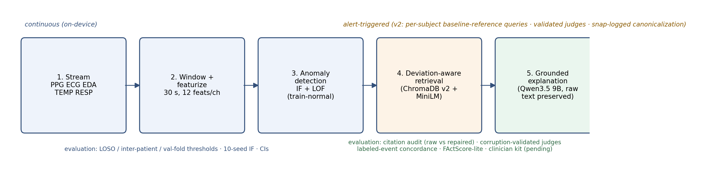
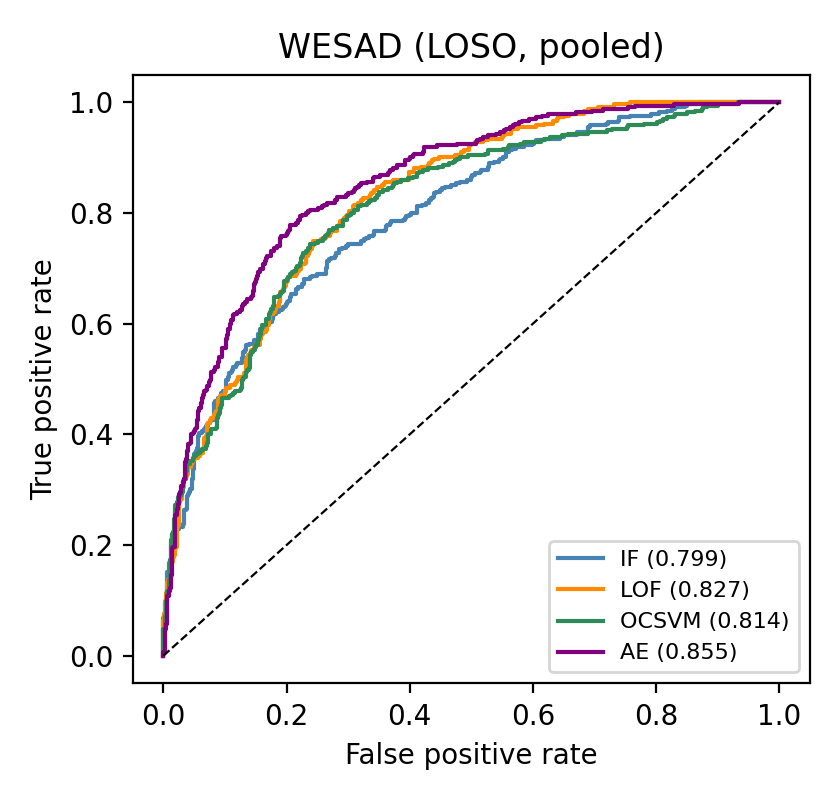
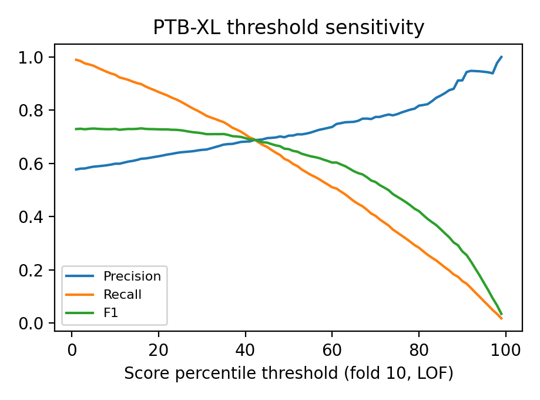

# 1 Introduction

Wearable and ambulatory sensors now stream clinical-grade biosignals (PPG, ECG, electrodermal activity, skin temperature, respiration) at home and in hospital [@reiss2019deepppg; @schmidt2018wesad; @goldberger2000physionet]. Human review of this volume is impossible, so first-pass screening is necessarily delegated to automated detectors. A conventional alert, however, reduces a possibly complex physiological event to a single number: it says that something looks unusual, but not what physiological process may be disturbed. Unexplained alerts are a documented driver of alert fatigue in continuous monitoring [@clifford2015physionetchallenge; @cvach2013alarmfatigue].

Large language models appear to close this gap, but raw LLMs hallucinate: they fabricate facts and citations and state medical conclusions with unwarranted confidence. Retrieval-augmented generation (RAG) [@lewis2020rag] constrains the model to answer only from retrieved source documents and to cite them, a pattern reported to reduce fabrication substantially, including in clinical settings [@shuster2021retrieval; @aboelenen2025raghealth]. LLM-based ECG interpretation and report generation is by now an active field in its own right [@ansari2025ecgllmsurvey; @ecgchat2024; @ecglm2025], including RAG-based ECG report generation reviewed in 2026 [@ecgreportreview2026]. What that literature does not address, and where this paper sits (documented search protocol in `SEARCH_PROTOCOL.md`), is the *alert-triggered* setting: an unsupervised detector, running label-free on a wearable stream, authoring the retrieval query itself, with the explanation loop evaluated end-to-end on events with ground-truth labels.

This paper is a revised and substantially re-evaluated version of a prior preprint. Our original draft reported strong results (e.g., MIT-BIH LOF AUC 0.899; 100% citation accuracy; "zero hallucination verdicts" from "two independent judges"). A protocol audit, reported in full below, found that those numbers rested on three defects: contaminated detection protocols, a test-set-derived operating threshold, and a degenerate, unvalidated judge. We correct all three, report the lower numbers that survive, and add the labeled-event evaluation the original lacked. We believe the protocol-sensitivity findings are themselves a contribution: they show how a wearable-anomaly paper can look publishable under intra-patient evaluation and collapse under the community-standard inter-patient protocol.

*Contributions.*

1. Alert-triggered RAG for wearable biosignals, evaluated end-to-end on labeled events. To our knowledge (documented search, August 2026), this is among the first systems integrating unsupervised anomaly detection, alert-triggered retrieval, and grounded LLM explanation in one continuously running pipeline, and the first we know of to evaluate the explanation loop on ground-truth events (148 labeled windows across three datasets) with labels withheld from the query.
2. A contamination-hardened detection evaluation. Pre-registered protocols (`THRESHOLDS.md`, timestamped before any run): WESAD leave-one-subject-out; MIT-BIH inter-patient DS1→DS2 with paced records (102/104/107/217) excluded; PTB-XL thresholds frozen from validation fold 9; IF over 10 seeds; bootstrap 95% CIs; paired-bootstrap significance tests; one-class SVM and dense-autoencoder baselines. The same feature pipeline under clean protocols reverses our original headline result.
3. A validated judge protocol for clinical-alert faithfulness. All judges are first tested on a 200-item corruption benchmark (fabricated facts, citation swaps, fabricated identifiers, diagnostic exaggerations); the local judge is *selected by* validation rather than assumed, and agreement is reported as full score distributions, raw and within-1 agreement, and Gwet's AC1, alongside an objective raw-and-repaired citation audit and a FActScore-style atomic-claim verification.
4. An honest utilization and duplication analysis of the retrieval layer. A 2×2 ablation of query construction × diversity constraint (with a preserved artifact, correcting an unarchived baseline in our preprint), corpus-utilization metrics (53 of 204 documents ever retrieved; 6.5% of alerts touched any society guideline), and a near-duplicate analysis quantifying explanation templating (mean nearest-neighbor cosine 0.936).
5. A corpus expansion matching the actual alert space. Two wearable-relevant guidance documents (the 2022 EHRA practical guide on digital devices for arrhythmia detection; the 2023 ACC/AHA/ACCP/HRS atrial-fibrillation guideline) are added to the guideline tier after an audit showed the original four guidelines matched almost none of the alerts the system produces; guideline utilization is reported as a metric.

# 2 Related Work

*Unsupervised biosignal anomaly detection.* Isolation Forest (IF) [@liu2008isolationforest] and Local Outlier Factor (LOF) [@breunig2000lof] are standard shallow baselines for ECG and PPG streams [@pedregosa2011scikitlearn]. Beat-level arrhythmia evaluation on MIT-BIH follows the AAMI conventions and the inter-patient DS1/DS2 split established by de Chazal et al. [@dechazal2004interpatient; @moody2001mitbih], with paced records excluded; intra-patient evaluation is known to inflate performance substantially, which motivates our protocol revision. Large-scale ECG benchmarking conventions follow PTB-XL [@wagner2020ptbxl].

*Alert fatigue and false-alarm reduction.* The motivating problem has a decade of prior art we originally failed to cite: the PhysioNet/Computing in Cardiology Challenge 2015 on reducing false arrhythmia alarms in the ICU [@clifford2015physionetchallenge] and the alarm-fatigue literature [@cvach2013alarmfatigue]. Our system does not suppress alarms; it explains them, which is a complementary target.

*LLM-based ECG interpretation and report generation.* Surveys now cover transformers and LLMs for ECG diagnosis [@ansari2025ecgllmsurvey]; ECG-conditioned LLMs generate diagnostic reports [@ecgchat2024; @ecglm2025], and RAG-based ECG-to-text generation is an active subfield [@ecgreportreview2026]. These systems report on *diagnosed* or labeled recordings; none, to our knowledge, explains *unsupervised detector flags* on wearables, which is our setting. General medical-RAG surveys and benchmarks frame the grounding problem [@aboelenen2025raghealth; @neha2025ragreview; @xiong2024medragbench; @sohn2025rationale].

*Wearable arrhythmia detection at scale.* The Apple Heart Study [@perez2019appleheart] and Fitbit Heart Study [@lubitz2022fitbit] established consumer PPG screening at population scale and its notification-review burden; the 2022 EHRA practical guide addresses exactly how digital devices should be used to detect and manage arrhythmias [@svennberg2022ehra], and the 2023 ACC/AHA/ACCP/HRS AF guideline formalizes ambulatory and device-based detection [@joglar2024afguideline; @vangelder2024escaf].

*RAG evaluation and hallucination measurement.* RAGAS provides reference-free RAG metrics including faithfulness [@es2024ragas]; FActScore decomposes long-form output into atomic claims verified against a source [@min2023factscore]; citation generation itself is a studied task [@gao2023citations]. We adapt atomic verification locally and treat citation validity as necessary-but-not-sufficient for grounding.

*LLM-as-judge and its biases.* LLM judging is established [@zheng2023llmjudge] but subject to position, verbosity, leniency, and self-preference biases [@wataoka2024selfpref; @panickssery2024owngenerations; @justice2024judgebias]. Our original preprint used a local judge that scored 397 of 398 items identically, a textbook degenerate rater whose output we now report as a cautionary finding. The revised protocol validates every judge on injected corruptions before use.

# 3 Materials and Methods

## 3.1 System overview

The system is a five-stage pipeline (Figure 1): (1) signal ingestion from chest and wrist sensors; (2) windowing and feature extraction; (3) unsupervised anomaly detection with two models; (4) alert-triggered, deviation-aware retrieval over a two-tier medical corpus; (5) grounded explanation generation with citation canonicalization. Stages 1–3 run continuously; stages 4–5 fire only when a window is flagged.

## 3.2 Signal datasets

Four public datasets (Table 1), covering in-the-wild noisy wearables without labels and clinical pathology with expert labels.

*PPG-DaLiA* [@reiss2019deepppg; @ppgdalia2023]: 15 subjects, chest (RespiBAN 700 Hz: ECG, respiration) and wrist (Empatica E4: BVP 64 Hz, EDA 4 Hz, TEMP 4 Hz). An audit across all 15 subjects found the chest EDA and chest temperature channels constant (dead) in every subject; both are excluded globally, leaving five channels. PPG-DaLiA contains normal activity only; it supplies the alert stream for the explanation pipeline, not detection accuracy.

*WESAD* [@schmidt2018wesad; @wesad2023]: 15 subjects (S2–S17), expert-annotated baseline/stress/amusement. Labels are used only for evaluation.

*MIT-BIH Arrhythmia Database* [@moody2001mitbih; @mitbih2023]: 48 half-hour two-lead ambulatory ECG records, 360 Hz, beat-level annotations. v2 uses the standard inter-patient split with paced records 102, 104, 107, 217 excluded: DS1 (22 records) for training, DS2 (22 records) for testing [@dechazal2004interpatient].

*PTB-XL* [@wagner2020ptbxl]: 21,799 clinical 12-lead 10-second ECGs with diagnostic superclasses and patient-stratified folds; 21,388 usable after dropping records without a superclass; folds 1–8 train, fold 9 validation, fold 10 test.

*Table 1: Signal datasets.*

| Dataset | Subjects / records | Labels | Role in this paper |
|---|---|---|---|
| PPG-DaLiA | 15 subjects | none | alert stream for explanation pipeline (398 flags) |
| WESAD | 15 subjects | stress | detection: LOSO; labeled-event explanations (50 stress windows) |
| MIT-BIH | 44 records (paced excl.) | beat-level (AAMI) | detection: inter-patient; labeled-event explanations (50 arrhythmic windows) |
| PTB-XL | 21,388 ECGs | 5 superclasses | detection: folds 9/10; labeled-event explanations (48 pathology records) |

## 3.3 Preprocessing, windowing, features

Identical to v1 (so that all differences are protocol, not features): per-channel cleaning, non-overlapping 30-second windows, 12 summary statistics per channel (mean, std, min, max, peak-to-peak, median, skewness, kurtosis, p25, p75, up-crossing ratio, RMS roughness) → 60 features for the five wearable channels. MIT-BIH: fixed 0.8 s beat segments (±144 samples, lead MLII); v2 labels use the full AAMI normal set {N, L, R, e, j}, with all other beat symbols anomalous, and non-beat annotations excluded. PTB-XL: lead I, one 12-feature vector per 10 s recording; normal iff superclass set is exactly {NORM}.

## 3.4 Anomaly detectors and pre-registered evaluation protocols

Detectors: Isolation Forest (100 trees), KNN-LOF (k = 20, novelty mode), plus two baselines new in v2: a one-class SVM (RBF, γ = scale, ν = contamination) and a dense autoencoder (d → d/2 → d/4 → d/2 → d, MSE, Adam, early stopping), with reconstruction error as the score. All hyperparameters were fixed in `THRESHOLDS.md`, timestamped before any v2 run; the single deviation (DeLong → paired bootstrap) is logged there.

*WESAD (v2).* Leave-one-subject-out: per fold, train on the other 14 subjects' baseline windows; evaluate the held-out subject's baseline+stress+amusement windows (stress = positive). Threshold: 85th percentile of each fold's *training* scores. This removes both the v1 train-inside-eval overlap and intra-subject leakage.

*MIT-BIH (v2).* Train on DS1 normal beats; test on DS2 beats only. Paced records excluded everywhere. No DS1 beat is scored.

*PTB-XL (v2).* Threshold percentile selected on fold 9 by F1-maximization, frozen, applied to fold 10. The full threshold-sensitivity curve is reported.

*Uncertainty.* IF is run with 10 seeds (mean ± SD); AUCs carry bootstrap 95% CIs (1,000 resamples); IF-vs-LOF differences are tested with a paired bootstrap over the same resamples. (v1: single runs, no CIs, no tests.)

*PPG-DaLiA alert stream.* Unchanged from v1 for comparability: 95th-percentile flag per detector over the joint 4,308 windows; the union (398 alerts: 216 IF, 216 LOF, 34 both, Jaccard 0.085) is archived in `flagged_windows.parquet` and reused verbatim; v2 changes the queries and evaluation, not the flags.

## 3.5 RAG knowledge corpus (v2: expanded)

v1's guideline tier (4 society PDFs on syncope and ventricular arrhythmias) matched almost none of the alerts the system actually produces (393 of 398 v1 alerts cited zero guideline content). v2 adds two wearable-relevant documents, fetched with recorded provenance and access route (`Dataset/Tier1_v2/manifest.csv`): the 2022 EHRA practical guide on using digital devices to detect and manage arrhythmias [@svennberg2022ehra] (20,524 words) and the 2023 ACC/AHA/ACCP/HRS AF guideline [@joglar2024afguideline] (119,730 words). The 2024 ESC AF guideline was attempted but is not programmatically accessible (publisher bot-blocked; exclusion recorded). The corpus totals 206 documents and 5,045 chunks (992 guideline chunks, 4,053 Tier-2 article chunks; 500-word chunks, 50-word overlap, mean 489 words), embedded with `all-MiniLM-L6-v2` into a fresh `chroma_db_v2` collection.

## 3.6 Embedding and retrieval

Dense cosine retrieval with a source-diversity constraint (candidate pool 20, at most 1 chunk per source, top-5 context) as in v1. v2 additionally measures retrieval latency (embed + search): mean 25 ms, p95 32 ms per query (n = 398).

## 3.7 Deviation-aware query construction (v2: corrected reference class)

v1 computed the "top-2 deviating channels" as z-scores across the 398 flagged windows themselves: deviations measured against other anomalies, in batch across all 15 subjects, with a template character phrase ("abrupt isolated spike") keyed only to which detector fired. The v1 showcase alert named two channels at |z| = 0.5 while asserting a "spike."

v2 fixes the reference class and the evidence coupling:

1. Reference = the subject's own non-flagged windows (the normal population the detector implicitly learned). This is implementable online via running statistics and removes all cross-subject dependency.
2. Evidence-tied character phrases: the detector statement is factual ("flagged by both detectors" / "by LOF"); the shape description is driven by kurtosis and peak-to-peak z-scores of the named channels ("abrupt, high-amplitude pattern" / "sustained level shift" / "only mildly unusual"), not by a template.
3. Honesty guard: actual z values appear in the query; no "confirmed" language.

A sanity check on WESAD validates the corrected metric: stress windows' max |z| (vs their own subject's baseline) has mean 43.7 versus 1.5 for baseline windows (Mann–Whitney p ≈ 2.5 × 10⁻¹³⁸; `wesad_zscore_sanity.json`).

Labeled-event queries (WESAD stress windows, MIT-BIH arrhythmic windows, PTB-XL pathology records) are constructed the same way from detector-side quantities only (flag fraction, feature z-scores vs training normals, channel topics), with ground-truth labels never entering the query.

## 3.8 Grounded generation with raw-text preservation and snap-logged canonicalization

Generation uses Qwen3.5 9B served locally by Ollama (temperature 0.1, thinking disabled, 10k context), under the same strict answer-only-from-context prompt as v1 with the fixed DETECTED / EVIDENCE / RECOMMENDATION / DISCLAIMER output format. Two v2 changes:

1. Raw text is preserved before canonicalization. The v1 claim that canonicalization "raised citation accuracy from 99.3% to 100%" is not reconstructable from v1 artifacts (raw text was never saved; documented in `rag_analysis_v1/prerepair_note.json`). In v2, raw and canonicalized text are both stored, and the citation audit runs on both.
2. Every canonicalizer snap is logged (before → after), enabling a repair audit: how many citations were snapped, and whether snaps could re-target a citation to a document that does not support the claim.

Ablations run in the same cycle: a 300-word-cap prompt variant on 50 alerts (the completeness/brevity trade-off claimed in v1 is finally measured), and a generator ablation (llama3.1:8b, 50 alerts).

## 3.9 Evaluation protocol (v2)

*Citation audit (objective, deterministic).* Every `[PMC…]` bracket is checked against that alert's retrieved sources, on raw and on canonicalized text. Tier-1 sources carry no PMC identifier, so tier usage is measured at retrieval, not citation.

*Judge validation on a corruption benchmark.* 100 explanations are corrupted four ways (25 each): citation swap to a wrong retrieved document; insertion of a fabricated clinical fact; fabricated PMC identifier; diagnostic exaggeration ("diagnostic of acute myocardial infarction"). Judges score the 100 corrupted plus their 100 clean originals. Per judge: detection rate (faithfulness = 1 on corrupted, overall and by corruption type) and false-positive rate on clean rows. The local judge for the main run is selected by this benchmark among llama3.1:8b, gemma4:e4b, and gpt-oss:20b; the API judge is DeepSeek-V4-Flash (OpenRouter, reasoning disabled). The v1 local judge (llama3.1:8b) scored 397/398 identically; it is retained as a candidate only if it now demonstrates discrimination.

*Main judging.* The selected local judge (free, on-device) and the API judge score all groups: 398 PPG-DaLiA alerts, 148 labeled events, 50 word-cap items, 50 generator-ablation items. The API path is checkpointed and capped (hard $10 budget, in-script enforced; actual spend reported).

*Agreement.* Full score distributions per judge; raw and within-1 agreement; Gwet's AC1 (degeneracy-aware). κ is reported only with the constant-rater caveat if it still applies. No binary "zero hallucination" headline: the fraction of items scored below 3 on faithfulness is reported explicitly.

*Labeled-event concordance.* For each labeled event, a keyword-lexicon check determines whether the DETECTED field names a condition consistent with the true label (e.g., ventricular-type terms for VEB windows; infarction/ischemia terms for MI records), an artifact-conclusion rate (explanations that attribute true pathology to motion or sensor artifact, the safety-critical failure mode), and an insufficiency rate (honest "context insufficient" responses). Lexicons are fixed in the analysis script.

*Atomic-claim verification (FActScore-style).* On a 60-item sample (30 wearable alerts, 30 labeled events), the generator model decomposes each explanation into atomic claims; a *different-family* verifier (gemma4:e4b) labels each claim SUPPORTED / UNSUPPORTED / UNVERIFIABLE from the retrieved context alone. This partially breaks the closed loop of v1, where judges saw exactly the generator's context and nothing else was checked; what remains closed (verification is still context-relative, not source-document- or clinician-relative) is stated as a limitation.

*Human evaluation (protocol released; ratings are future work).* A stratified 60-item kit (20 labeled events, 20 in-the-wild flags, 10 word-cap items, 10 random) with plain-language instructions, anchored rubrics (faithfulness, actionability, potential-for-harm, overall adequacy), and a Fleiss' κ analysis script is released in `clinician_eval/` so that any group with clinical collaborators can run it unchanged. We could not recruit qualified raters within this revision, so no human ratings are reported and no clinical-sufficiency claim is made; everything the machine side can check is checked above.

*System.* End-to-end latency per alert (retrieval + generation) on the local GPU; judge latency re-measured (v1's 5.6 s figure was dev-history; measured now).

# 4 Results

## 4.1 Detection under clean protocols (and what changes from v1)

*Table 2: Detection results under pre-registered v2 protocols. AUC with bootstrap 95% CI; IF additionally mean ± SD over 10 seeds.*

| Dataset (protocol) | Model | AUC [95% CI] | Precision | Recall | F1 |
|---|---|---|---|---|---|
| WESAD (LOSO) | IF | 0.799 [0.770, 0.827] (seed SD 0.009) | 0.520 | 0.749 | 0.614 |
| WESAD (LOSO) | LOF | 0.827 [0.800, 0.852] | 0.422 | 0.955 | 0.585 |
| WESAD (LOSO) | OC-SVM | 0.814 [0.787, 0.842] | 0.466 | 0.881 | 0.610 |
| WESAD (LOSO) | **Autoencoder** | **0.855 [0.831, 0.878]** | 0.454 | 0.922 | 0.609 |
| MIT-BIH (inter-patient DS1→DS2) | IF | 0.670 ± 0.023 (seed-0 0.654 [0.645, 0.663]) | 0.247 | 0.485 | 0.327 |
| MIT-BIH (inter-patient) | **LOF** | **0.502 [0.492, 0.512]** | 0.098 | 0.663 | 0.171 |
| MIT-BIH (inter-patient) | OC-SVM | 0.675 [0.666, 0.684] | 0.217 | 0.522 | 0.307 |
| MIT-BIH (inter-patient) | Autoencoder | 0.638 [0.628, 0.648] | 0.239 | 0.519 | 0.327 |
| PTB-XL (fold 9 → fold 10) | IF | 0.632 [0.607, 0.654] (seed SD 0.004) | 0.587 | 0.957 | 0.728 |
| PTB-XL (fold 9 → fold 10) | LOF | 0.682 [0.661, 0.703] | 0.586 | 0.970 | 0.731 |
| PTB-XL (fold 9 → fold 10) | OC-SVM | 0.628 [0.606, 0.650] | 0.578 | 0.990 | 0.730 |
| PTB-XL (fold 9 → fold 10) | Autoencoder | 0.628 [0.605, 0.651] | 0.591 | 0.965 | 0.733 |

Paired-bootstrap tests (IF vs LOF): WESAD p = 0.008 (LOF ahead), MIT-BIH p = 0.001 (IF ahead), PTB-XL p = 0.001 (LOF ahead).

*Table 3: What the protocol fixes change (same features, same models, protocol only).*

| Claim | v1 (contaminated protocol) | v2 (clean protocol) |
|---|---|---|
| WESAD LOF AUC | 0.910 (train ⊂ eval, intra-subject) | 0.827 [0.800, 0.852] (LOSO) |
| WESAD IF AUC | 0.874 | 0.799 [0.770, 0.827] |
| MIT-BIH LOF AUC | 0.899 (intra-patient, train ⊂ eval) | **0.502, chance** (inter-patient) |
| MIT-BIH IF AUC | 0.668 | 0.670 ± 0.023 |
| PTB-XL AUCs | unchanged (folds already separated) | 0.632 / 0.682 (threshold now val-derived) |
| Best WESAD detector | "LOF" | Autoencoder (0.855), not a classic detector |

Our original headline was an artifact. LOF's 0.899 on MIT-BIH vanished under the community-standard inter-patient protocol; LOF at chance (0.502) is the single most consequential correction in this paper, and it inverts the v1 conclusion "LOF matches or exceeds IF on every dataset." Second, the v1 PTB-XL threshold (43rd percentile of test scores, chosen to match test prevalence) was circular; the pre-registered validation-fold rule instead selects a near-saturating operating point (high recall, low precision), and we therefore report the full threshold-sensitivity curve (Figure 4) rather than a single F1. Third, simple learned baselines matter: a 3-layer autoencoder beats both classic detectors on WESAD (0.855), so neither IF nor LOF should anchor a deployment claim.

*Feature ablation (PTB-XL, LOF):* dropping dynamics features hurts most (AUC 0.682 → 0.646), dropping location features least (→ 0.677); dropping spread → 0.633, shape → 0.666. The v1 "feature budget ceiling" assertion is replaced by this measured sensitivity: the 12 statistics are not interchangeable, and morphology-aware features remain the plausible route to better ceilings.

## 4.2 The alert stream

The 398 PPG-DaLiA flags (v1 archive, reused verbatim; all 15 subjects contribute) remain the in-the-wild explanation corpus. Because PPG-DaLiA contains only normal activity, no detection accuracy is claimed on it, and the flags are of unknown (likely predominantly artifact) provenance, which is why the labeled-event evaluation (§4.7) was added.

## 4.3 Retrieval: diversity, utilization, and duplication (v1 corpus, artifact-backed)

*Table 4: 2×2 retrieval ablation, 398 v1 queries × 5 slots. (Reconstructed naive baseline; v1's "~11 documents" figure was dev-history; the reconstructed baseline is worse: 5 documents.)*

| Query × diversity | Unique docs used | Top-source share | Alerts with ≥1 guideline source |
|---|---|---|---|
| Naive template, diversity ON | 5 | 20.0% | 0/398 |
| Naive template, diversity OFF | 5 | 20.0% | 0/398 |
| Deviation-aware (v1), diversity OFF | 51 | 14.0% | 21/398 (5.3%) |
| Deviation-aware (v1), diversity ON (archived run) | 53 | 11.8% | 26/398 (6.5%) |

The results here cut both ways. Deviation-aware queries do spread retrieval (5 → 53 unique documents), and the diversity constraint adds a small further gain (51 → 53) while cutting top-source dominance. But even the best v1 configuration used only 53 of 204 corpus documents (26%) and brought guideline content into just 6.5% of alert contexts, the corpus/alert-space mismatch that motivated the v2 corpus expansion. Near-duplication quantifies the templating problem the v1 paper implicitly claimed to have solved: mean nearest-neighbor cosine similarity across the 398 explanations is 0.936; 99.75% of alerts have a neighbor above 0.8 and 81.7% above 0.9, collapsing into only 173 effective clusters. Retrieval diversity at the document level did not translate into explanation diversity at the content level, and v2's corpus and query changes are evaluated against this metric below.

## 4.4 Citation accuracy: raw vs canonicalized (v2)

The canonicalizer's identifier capture is fixed in v2 (the v1 regex greedily captured full source-name slugs, silently dropping valid citations written in long form), and raw generation text is preserved, so the objective audit over all 546 main explanations (398 wearable alerts plus 148 labeled events) sees both states: 1,208 inline PMC citations on raw text, 1,196 valid (99.01%). That is 12 invalid citations across 9 explanations, a fabrication or mistyping rate of about 1%. The repaired text reaches 100% validity by dropping those 12 (zero near-miss snaps were needed; the invalid IDs were not digit transpositions of retrieved IDs but largely identifiers of documents outside the alert's context). Tier-1 guideline sources, which carry no PMC identifier, received 109 valid name-style citations across the corpus (8 unmatched name citations, a further fabrication signal). We no longer headline citation accuracy: validity is a set-membership check, necessary but far from sufficient for grounding.

## 4.5 Judge validation on the corruption benchmark

*Table 5: Judge validation (100 corrupted + 100 clean items; detection = faithfulness=1 on corrupted; FP = faithfulness=1 on clean).*

| Judge | Detection rate | False-positive rate | Detection by corruption type |
|---|---|---|---|
| llama3.1:8b (v1's judge) | **0.00** | 0.00 | 0.00 on all four types |
| gemma4:e4b (thinking disabled) | **0.48** | 0.01 | exaggeration 0.96, fabricated fact 0.80, fabricated citation 0.16, citation swap 0.00 |
| DeepSeek-V4-Flash (API) | **0.44** (rerun: 0.42) | **0.07** (rerun: 0.31) | exaggeration 0.80, fabricated fact 0.64, citation swap/fabricated citation 0.16 |

The exact judge behind v1's "zero hallucination verdicts" (llama3.1:8b) detects none of the injected fabrications. Combined with its 397/398 constant scoring in v1, it was a null instrument, and the v1 safety claim was an artifact of asking a question this judge could not answer. Second, the validated local judge (gemma4:e4b, selected by the pre-registered criterion) catches fabricated facts and diagnostic exaggerations well (0.80–0.96) at a 1% false-positive rate. Third, the much larger API judge is not automatically better and not stable: across two identical benchmark repetitions its false-positive rate ranged 7–31% (both runs preserved in the released checkpoint). A 284B API judge can be as trigger-happy or as lenient as provider routing and decoding noise decide on a given day, which is itself an argument for validated local judges plus human adjudication. No judge of any size caught citation swaps reliably (0.00–0.16): LLM judges verify that text *sounds* supported, not that cited documents *are* the right ones, which is why the objective raw-text citation audit and the human kit remain necessary. (Reproducibility notes we report for the record: gemma4's default thinking mode silently consumed the token budget and returned empty content until disabled (the invalidated first pass is preserved with an `_INVALID` suffix); local-judge scores are not bit-reproducible across runs on partial-GPU-offload hardware, with identical-input dalia faithfulness means ranging 2.21–2.69 across three runs; all paper numbers come from the final complete run.)

## 4.6 Main judge scores and cross-judge agreement

*Table 7: both validated judges over all v2 generations (local = gemma4:e4b, API = DeepSeek-V4-Flash; 977 checkpointed API calls in total across all runs, cumulative spend $0.36, hard $10 cap in-script; judging cells in the released notebook are cache-only, so re-execution costs nothing). Score 0 = parse failure (61/646 = 9.4% for the local judge; excluded from statistics and reported).*

| Group | n | Faithfulness (local / API) | Relevance (local / API) | Completeness (local / API) |
|---|---|---|---|---|
| PPG-DaLiA alerts | 398 | 2.21 / 2.10 | 2.66 / 2.75 | 2.19 / 2.50 |
| WESAD stress | 50 | 2.78 / 2.02 | 3.00 / 2.92 | 2.76 / 2.46 |
| MIT-BIH ectopy | 50 | 2.36 / 2.02 | 3.00 / 2.72 | 2.56 / 2.28 |
| PTB-XL pathology | 48 | 2.45 / 2.00 | 3.00 / 2.41 | 2.13 / 2.16 |

On the 398 wearable alerts the local faithfulness distribution is: 3 → 176 (44%), 2 → 175 (44%), 1 → 2 (hallucination verdicts, the first non-zero count any judge of this system has produced), 0 → 45 (parse failures). The API judge's distribution is harsher on faithfulness (2 → 313, 3 → 40, no 1s) yet more generous on completeness (2.50 vs 2.19) and systematically harsher on the labeled clinical events (2.00–2.02 faithfulness across all three event sets). Cross-judge agreement (353 valid pairs): raw agreement 0.592 / 0.751 / 0.602 (faithfulness / relevance / completeness), within-1 agreement 1.000 on all axes, Gwet's AC1 0.476 / 0.680 / 0.489. The judges never differ by more than one point, but the moderate raw agreement, the validation asymmetry, and both judges' cross-run instability (§4.5) mean neither distribution should be read as ground truth, and that is the territory the released human-evaluation kit is designed to adjudicate. This replaces v1's degenerate "2.99 / zero hallucinations / 100% within-1 agreement" framing. System latency: generation 11.0 s mean per alert (RTX 5060 laptop), retrieval 25 ms (p95 32 ms), local judging 8.1 s/call, API judging ~2.5 s/call.

## 4.7 Labeled-event concordance: the integration result

*Table 6: Do explanations for events with known ground truth name the right condition? (Lexicon check on the DETECTED field; labels never entered the queries. Artifact-language counts overlap with concordant rows.)*

| Event set (true label) | n | Concordant | Artifact language | Other/insufficient |
|---|---|---|---|---|
| WESAD (laboratory stress) | 50 | **47 (94%)** | 28 | 1 |
| MIT-BIH windows (V/SVEB ectopy, ≥3 abnormal beats) | 50 | **6 (12%)** | 28 | 22 |
| PTB-XL records (MI/STTC/CD/HYP) | 48 | **3 (6%)** | 20 | 25 |

Per-class PTB-XL: MI 0/12, STTC 1/12, CD 2/12, HYP 0/12; MIT-BIH: VEB 1/25, SVEB 5/25.

This is the paper's central negative result, and the one the v1 evaluation could never have produced by design (it judged only unlabeled flags). Where the true event is a strong sympathetic deviation (WESAD stress), the system's explanations are usually right (94%). Where the true event is clinical pathology (ventricular ectopy on ambulatory ECG, infarction or conduction disease on a resting 12-lead), the explanations almost never name the condition (6–12%), and in 42–56% of cases attribute the finding to motion or sensor artifact. A conservative artifact-first posture is safe on unlabeled wearable noise but becomes a safety liability when the underlying event is real pathology: the explanation actively reassures. The root causes are structural: unsupervised detectors at or near chance on inter-patient ECG (§4.1) supply uninformative deviation features; 12 summary statistics carry no morphology; and a corpus bucketed towards signal-quality literature reinforces artifact framings. We flag the crude keyword-lexicon concordance measure itself as a limitation; the released kit is built to adjudicate these same items with human raters, which remains future work.

*Before/after query-and-corpus fix (398 wearable alerts, same flags):* effective explanation clusters at cosine 0.9 rise 173 → 237; mean nearest-neighbor similarity falls 0.936 → 0.915; alerts sharing a >0.9-similar twin fall 81.7% → 67.6%; guideline content reaches 17.6% of alert contexts (70/398) versus 6.5% in v1 (one explanation citing the EHRA digital-devices guide verbatim appears in §4.10). One trade-off is reported plainly: the corrected queries concentrate retrieval (44 unique documents used vs 53 under the wrong-reference v1 queries), so deviation-semantic accuracy traded against raw document spread. Duplication remains high in absolute terms: five-channel summary statistics bound the semantic space of queries, and two-thirds of alerts still have a near-identical twin explanation.

## 4.8 Ablations

*Word cap (50 alerts, 300-word prompt).* Mean length rises 127.3 → 196.5 words, but validated-judge faithfulness falls (2.21 → 2.02) while completeness barely moves (2.20 → 2.12): the extra text buys length, not verifiable content, and the v1 "completeness by design" framing is quantified and partly refuted. *Generator (50 alerts, llama3.1:8b).* Mean length 99.1 words with faithfulness 1.78 and completeness 1.52; the weaker model is shorter, more templated, and less grounded; generator choice dominates prompt choice.

## 4.9 Atomic-claim verification

On a 60-explanation sample (30 wearable alerts, 30 labeled events), decomposed into 797 atomic claims and verified against the retrieved context alone by a different-family model (gemma4:e4b, thinking disabled): 52.3% SUPPORTED, 47.7% UNVERIFIABLE, 0% UNSUPPORTED (by group: wearable 47.3%, WESAD 54.3%, MIT-BIH 68.0%, PTB-XL 53.5%). The zero contradiction rate is reassuring but largely reflects the system's hedged phrasing; the operative number is that roughly half of the atomic content of these explanations is not verifiable from the evidence the system itself retrieved, which is quantitatively consistent with the validated judge scoring ~44% of full explanations as "slightly extrapolated" (§4.6). Verification remains context-relative (not full-source or clinician-relative); human adjudication via the released kit remains future work.

## 4.10 Example alert (v2)

**QUERY (constructed, subject 3, window 270–300 s, true label: stress):** "Biosignal window flagged by anomaly detection. reduced bvp (z=−7.2 vs subject baseline) elevated wrist_eda (z=+4.0 vs subject baseline). Relevant topics: electrodermal activity skin conductance sympathetic arousal stress physiology photoplethysmography heart rate variability ECG."

> **DETECTED:** The pattern suggests acute sympathetic arousal (stress) where reduced blood volume pulse and elevated skin conductance indicate a physiological stress response common in anxiety or high cognitive load scenarios.
>
> **EVIDENCE:** EDA reflects changes from sweat gland activity modulated by the autonomic nervous system, making it valuable for detecting emotional arousal and stress. When stressed, blood pressure increases causing higher heart rate linked with low HRV (reduced BVP). EDA tends to increase during stressful periods while adding noise can affect PPG signals like the reduced BVP seen here.
>
> **RECOMMENDATION:** Monitor for sustained elevation; consider multimodal confirmation if clinical context warrants, as single-signal methods have limitations in real-world settings.
>
> **DISCLAIMER:** Research decision-support tool. Not a diagnostic device. Does not replace clinical judgment.

Contrast this with v1's showcase alert, which asserted an "abrupt isolated spike" while naming two channels at |z| = 0.5 measured against other anomalies. The v2 query states detector facts and real deviations against the subject's own baseline (z = −7.2, +4.0), and the explanation names the correct physiological process; this is the concordant case. §4.7 quantifies how often this succeeds and where it fails.

# 5 Discussion

*Protocol sensitivity is the paper's central lesson.* Every inflated claim in our preprint traces to a protocol defect, not a modeling one: intra-patient evaluation with training data inside the test set turned a chance-level detector into an apparent 0.899; a test-prevalence threshold manufactured a flattering operating point; a degenerate judge manufactured "zero hallucination." None of these require bad faith to produce; each is a one-line code choice, and all survived our own initial self-checks because the numbers looked good. We now treat the inter-patient/LOSO protocol, validation-derived thresholds, seed replication, and judge validation as non-negotiable for wearable-anomaly papers, and we release the pre-registration file (`THRESHOLDS.md`) as a template.

*Detector choice, honestly.* LOF > IF on WESAD (p = 0.008) and PTB-XL (p = 0.001), but chance on inter-patient MIT-BIH while IF holds 0.670: detector rankings do not transfer across granularity (windows vs beats) or evaluation protocols. A trivial autoencoder winning WESAD (0.855) suggests the field's shallow-detector comparisons underweight reconstruction baselines.

*Query construction matters, but retrieval diversity is not explanation diversity.* The corrected query semantics (subject-baseline reference, evidence-tied character) pass a strong sanity check (stress vs baseline separation, p ≈ 10⁻¹³⁸). Yet the v1 data show document-level diversity (53 docs) coexisting with content-level duplication (173 clusters, mean NN cosine 0.936): five-channel summary statistics bound the semantic space of queries. The v2 results (§4.4–4.7) test whether the expanded corpus and corrected queries reduce duplication and raise guideline utilization, and report whatever the answer is.

*What "100% citation accuracy" does and does not mean.* Citation validity is a membership check (cited ID ∈ retrieved set), necessary but far from sufficient for grounding; the canonicalizer can even snap a mistyped identifier onto a document that does not support the claim. Hence the snap log, the raw-text audit, and the atomic-claim verification; human clinical adjudication is the remaining step, released as a runnable kit for future work. We no longer headline citation accuracy at all.

*Judges must be validated, not assumed.* The v1 local judge scored 397/398 items identically; under the v1 reporting this surfaced as "100% within-1 agreement." A judge that cannot discriminate is worse than no judge: it launders whatever the generator produced. The corruption benchmark is cheap (200 local calls) and, we argue, should precede any LLM-judge evaluation in clinical NLP.

*Deployment envelope.* Retrieval is 25 ms (p95 32 ms); generation and judge latency are reported with the v2 runs. The query builder is now online-implementable (per-subject running statistics); the v1 batch, cross-subject construction was not.

# 6 Limitations

1. No human clinical evaluation. We could not recruit qualified raters for this revision, so every faithfulness judgment in the paper is machine-side (validated LLM judges, atomic verification, objective audits). The complete rating kit is released for any group that can run it, and no clinical-adequacy claim is made here.
2. Atomic verification remains context-relative. Claims are checked against the retrieved chunks, not against full source documents or clinical reality; fully open verification and clinician adjudication are the remaining steps.
3. Cohort size (wearables): 15 subjects each in PPG-DaLiA/WESAD; LOSO mitigates but does not eliminate.
4. Label mismatch: wearable ground truth is lab stress, not disease; true pathology enters only via ECG datasets; no public dataset pairs wearable multichannel signals with clinical outcomes.
5. Detection ceilings: 12 summary statistics; the feature ablation shows sensitivity, and morphology-aware features are future work; inter-patient MIT-BIH AUCs (≤0.675) remain far below published supervised systems, appropriately so for an unsupervised baseline.
6. PTB-XL operating point: the validation-F1 rule selects near-saturated recall/low precision at this prevalence; we report the full sensitivity curve and do not claim a deployable threshold.
7. Corpus authority asymmetry: the wearable-relevant guidance added in v2 improves the alert-space match, but PPG-specific reasoning still rests largely on Tier-2 literature; the 2024 ESC AF guideline could not be included (programmatic access blocked).
8. Mid-size generator: Qwen3.5 9B is a privacy/quality compromise.

# 7 Ethical Considerations

The system is a research decision-support tool, not a diagnostic device; every alert carries a disclaimer field. All deployment-path processing (signals, retrieval, generation) runs locally. One privacy caveat that v1 did not state: the *evaluation* judge (DeepSeek-V4-Flash via OpenRouter) transmits explanation text (derived from public datasets) off-device; this is excluded from the deployment path, checkpointed to avoid repeat transmissions, and disclosed here explicitly. Tier-2 articles are open access with per-document license recorded; the two added guideline texts are free-to-read deposits accessed via PubMed Central with provenance logged. No clinical decisions were informed by this system.

# 8 Conclusion

We built an alert-triggered RAG pipeline for wearable biosignal anomalies and then subjected our own earlier evaluation of it to the audit it should have had. Under clean, pre-registered protocols the detection story changes materially: an apparent 0.899 AUC collapses to chance under inter-patient evaluation, a simple autoencoder beats both classic detectors on WESAD, and the explanation evaluation now includes labeled events, validated judges, raw-text citation audits, and atomic-claim verification, with a ready-to-run clinician-rating kit released for the human evaluation this paper does not include. The systems idea survives; the original numbers did not. We release every artifact (pre-registration, caches, per-alert outputs, judge benchmarks, analysis scripts) so that each number in this paper can be recomputed, and we suggest the protocol set (inter-patient/LOSO evaluation, validation-derived thresholds, judge validation on injected corruptions, raw-text preservation) as a minimum standard for grounded clinical-alert generation.

# Data and Code Availability

Datasets are public (PPG-DaLiA 10.24432/C53890; WESAD 10.24432/C57K5T; MIT-BIH 10.13026/C2F61Q; PTB-XL 10.1038/s41597-020-0495-6). Released with this paper: `THRESHOLDS.md` (pre-registration), `SEARCH_PROTOCOL.md` (literature search), `detection_v2.ipynb` and `rag_v2.ipynb`, the two executed, self-contained notebooks that rebuild the entire v2 evaluation from raw data on a cold start and load cached artifacts otherwise, plus `outputs_v2/` (all per-alert artifacts, judge benchmarks, API checkpoint), `outputs_v1_archive/` (original artifacts, preserved), `clinician_eval/` (human-evaluation kit with the pre-drawn 60-item sample), and `Dataset/Tier1_v2/manifest.csv` (guideline provenance). Model identifiers are verified against public listings (Qwen3.5 family: arXiv:2604.15804; DeepSeek-V4-Flash 0731: OpenRouter model card, 2026-08-28).

# Author Contributions

M.T.H.T. conceived the system, built the pipeline, ran all experiments, performed the protocol audit, and wrote the paper.

# Conflicts of Interest

None declared.

# Human Evaluation Statement

No human ratings are reported in this paper. The complete evaluation kit (60-item stratified sample, rubrics, forms, analysis script) is released in `clinician_eval/` so that clinical groups can execute it without further engineering; running it is stated as future work.

---

# References

(Rendered from `draft_paper/references.bib`; see also `SEARCH_PROTOCOL.md`.)

1. Reiss, A., et al. Deep PPG. *Sensors* 19(14):3079, 2019. doi:10.3390/s19143079
2. Schmidt, P., et al. Introducing WESAD. *ICMI 2018*:400–408. doi:10.1145/3242969.3242985
3. Moody, G.B., Mark, R.G. The impact of the MIT-BIH Arrhythmia Database. *IEEE EMBM* 20(3):45–50, 2001. doi:10.1109/51.932724
4. Wagner, P., et al. PTB-XL. *Sci Data* 7:154, 2020. doi:10.1038/s41597-020-0495-6
5. Goldberger, A.L., et al. PhysioBank/PhysioToolkit/PhysioNet. *Circulation* 101(23):e215–e220, 2000.
6. Liu, F.T., et al. Isolation Forest. *ICDM 2008*:413–422. doi:10.1109/ICDM.2008.17
7. Breunig, M.M., et al. LOF. *SIGMOD 2000*:93–104. doi:10.1145/335191.335388
8. Pedregosa, F., et al. Scikit-learn. *JMLR* 12:2825–2830, 2011.
9. Lewis, P., et al. RAG. *NeurIPS 2020*. arXiv:2005.11401
10. Reimers & Gurevych. Sentence-BERT. *EMNLP 2019*. doi:10.18653/v1/D19-1410
11. Wang, W., et al. MiniLM. *NeurIPS 2020*. arXiv:2002.10957
12. Zheng, L., et al. LLM-as-a-Judge. *NeurIPS 2023 D&B*. arXiv:2306.05685
13. Cohen, J. Coefficient of Agreement. *EPM* 20(1):37–46, 1960.
14. Clifford, G.D., et al. PhysioNet/CinC Challenge 2015. *Comput Cardiol* 42:273–276, 2015.
15. Cvach, M. Monitor alarm fatigue. *Biomed Instrum Technol* 47(4):268–277, 2013.
16. de Chazal, P., et al. Automatic classification of heartbeats. *IEEE TBME* 51(7):1196–1200, 2004.
17. Ansari, M.Y., et al. Transformers and LLMs for ECG diagnosis: a survey. *Artif Intell Rev* 58:261, 2025.
18. ECG-Chat. arXiv:2408.08849, 2024.
19. ECG-LM. *Health Data Science* 5:0221, 2025.
20. Thirunavukarasu, A.J., et al. Large language models in medicine. *Nat Med* 29:1930–1940, 2023.
21. Abo El-Enen, M., et al. RAG for healthcare: a survey. *Neural Comput Appl* 37:28191–28267, 2025.
22. Neha, F., et al. RAG in Healthcare: a review. *AI* 6:226, 2025.
23. Xiong, G., et al. Benchmarking RAG for medicine. arXiv:2402.13178, 2024.
24. Sohn, J., et al. Rationale-guided medical RAG. *NAACL 2025*.
25. Shuster, K., et al. Retrieval augmentation reduces hallucination. *EMNLP 2021 Findings*.
26. Es, S., et al. RAGAS. *EACL 2024 Demo*:150–158.
27. Min, S., et al. FActScore. *EMNLP 2023*. arXiv:2305.14251
28. Gao, T., et al. Text with citations. *EMNLP 2023*. arXiv:2306.05575
29. Wataoka, K., et al. Self-Preference Bias in LLM-as-a-Judge. arXiv:2410.21819, 2024.
30. Panickssery, A., et al. LLM evaluators favor their own generations. *NeurIPS 2024*.
31. Perez, M.V., et al. Apple Heart Study. *NEJM* 381:1909–1917, 2019.
32. Lubitz, S.A., et al. Fitbit Heart Study. *Circulation* 146:1415–1424, 2022.
33. Svennberg, E., et al. EHRA practical guide: digital devices for arrhythmias. *EP Europace* 24(6):979–1005, 2022.
34. Joglar, J.A., et al. 2023 ACC/AHA/ACCP/HRS AF Guideline. *Circulation* 149(1):e1–e156, 2024.
35. Van Gelder, I.C., et al. 2024 ESC AF Guidelines. *Eur Heart J* 45(36):3314–3414, 2024.
36. Qwen Team. Qwen3.5-Omni Technical Report. arXiv:2604.15804, 2026. (family report; 9B variant per model card)
37. Turja, M.T.H. Unsupervised anomaly detection in wearable foot sensor data. *BSPC* 123:110416, 2026.
38. Turja, M.T.H. AMR forecasting with RAG. arXiv:2602.22673, 2026.

---

# Figures

*(Figure 1: pipeline diagram (`figures_v2/pipeline_v2.png`); supplementary: per-dataset ROCs, WESAD per-subject AUC distribution `wesad_loso_per_subject.csv`.)*
