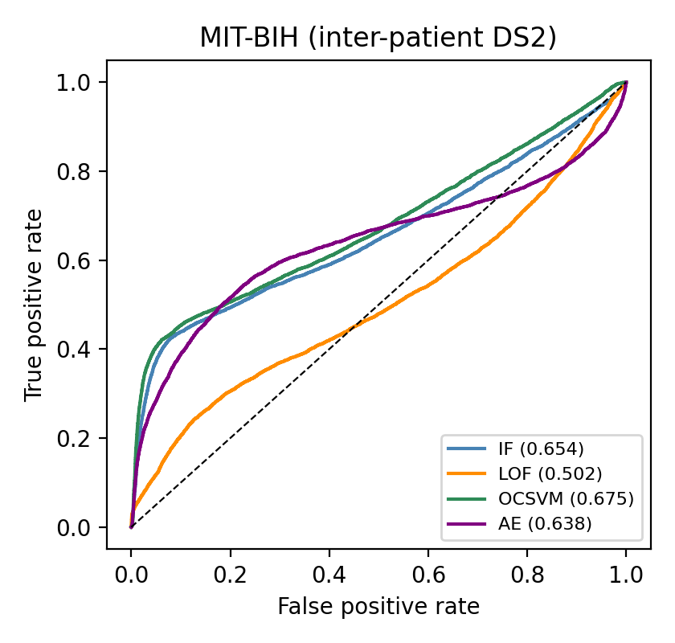
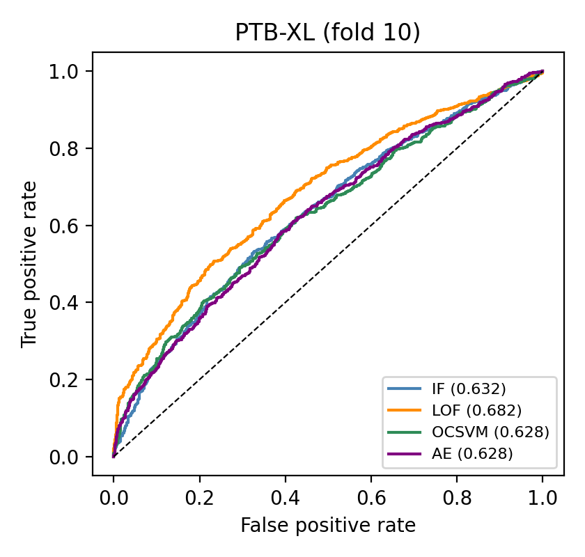

# 1 Introduction

Continuous ambulatory monitoring now streams five or more biosignal channels per patient, and first-pass screening is necessarily delegated to automated detectors [@reiss2019deepppg; @schmidt2018wesad; @goldberger2000physionet]. The operational cost of that delegation is well quantified: a large majority of continuous-monitoring alarms require no clinical action, and each unexplained alarm taxes reviewer attention in a workflow that cannot scale with alarm volume [@clifford2015physionetchallenge; @cvach2013alarmfatigue; @icufalsealarmreview2022]. An alert that reduces a possibly complex physiological event to one number transfers the entire interpretive burden to a human who is already saturated. Consumer-screening programs at population scale have reproduced the same bottleneck one level up: notification review burden, not detection sensitivity, is the binding constraint [@perez2019appleheart; @lubitz2022fitbit].

The engineering responses to this problem divide into two families, and both fail at the same meta-level. Detector research produces rankings among unsupervised anomaly detectors such as Isolation Forest (IF) [@liu2008isolationforest], Local Outlier Factor (LOF) [@breunig2000lof], and one-class and reconstruction baselines, evaluated under protocols that silently leak: training records inside test sets, thresholds tuned to test prevalence. Large language models are moving into medicine broadly [@thirunavukarasu2023llmmedicine], and LLM-explanation research couples generators to retrieval [@lewis2020rag; @shuster2021retrieval; @aboelenen2025raghealth] and grades the output with LLM judges or citation checks [@es2024ragas; @min2023factscore], instruments that are themselves rarely validated; ECG report generation is by now an active subfield [@ansari2025ecgllmsurvey; @ecgchat2024; @ecglm2025; @ecgreportreview2026]. Each family reports encouraging numbers. What neither reports is whether the numbers measure the system or the evaluation design.

We answer that question by auditing, instrument by instrument, a pipeline of the kind the field is building: unsupervised detectors on 30-second wearable windows trigger deviation-aware retrieval over society guidelines and open-access literature, and a local LLM writes a structured explanation (DETECTED / EVIDENCE / RECOMMENDATION / DISCLAIMER) with citations, entirely on-device. The pipeline is the testbed; the contribution is the audit, demonstrated on this one system. Concretely:

1. A protocol-sensitivity analysis with cluster-aware inference. Under pre-registered, contamination-hard protocols, we quantify what each evaluation choice is worth: intra-patient evaluation converts a chance-level inter-patient detector (LOF 0.502, record-cluster CI [0.32, 0.75]) into an apparent 0.899; resampling beats instead of records shrinks reported CIs by roughly twenty-fold; and the WESAD detector ranking is not stable to either protocol or defensible feature-set pruning (autoencoder 0.855 → 0.689 when redundant location statistics are dropped).
2. An explanation-loop audit that separates query leakage from evidence content. Labeled-event concordance (148 events across three datasets, ground-truth labels withheld from the query) shows 94% concordance on stress but 12% on ectopy and 6% on pathology. We show the 94% is partly manufactured: the query builder injected condition vocabulary ("stress", "arousal") that the generator echoes. Condition-blind queries reduce stress concordance to 68-72% across three runs (58% under the strictest topic list), a 22-36-point drop that the decomposition arms split between prompt echo and retrieval steering, and flag-status analysis shows only 69/148 events would even fire under pre-registered operating points.
3. A security blind-spot measurement. A corruption-validated judge (48% detection at 1% false positives) and a raw-text citation audit together catch generator-side fabrication at a 1% rate, but a single planted corpus chunk, placed in context, steers urgent-care recommendations into 48 of 50 regenerated alerts (against a 7.6% marker baseline), is cited by its planted identifier in 50 of 50 generations against a zero baseline, and is certified "fully grounded" by the validated judge in 31 of 38 parsed cases. Seeding the same chunk into the vector store loses naive retrieval 50 of 50 times, but we scope that result to unsophisticated seeding: optimized corpus-poisoning attacks against dense retrievers and RAG pipelines are published and effective [@zhong2023poisoning; @zou2025poisonedrag]. The claim we defend is about the evaluation stack, not the retriever: once a manipulated source is in context, every standard instrument passes it.

Every number in this paper is recomputable from the released artifacts by the released code, with consistency and correctness separately instrumented: `python draft_paper/verify_claims_v2.py` checks manuscript-artifact consistency for the headline claims, `python draft_paper/test_mappings.py` unit-tests the index-mapping code paths (the class of code behind a corrected interim value, Appendix B), and `python scripts/robustness/independent_concordance.py` reproduces every arm's counts through an independent implementation. Pre-registration and search protocols are timestamped, and a clinician-rating kit is released for the human adjudication our machine instruments cannot replace. We release the audit battery (inter-patient/LOSO evaluation, cluster-level inference, validation-derived thresholds, corruption-validated judges, raw-text preservation, condition-blind and shuffled-topic query controls, and corpus-integrity probes) as a candidate protocol demonstrated on one system; establishing it as a standard requires the multi-system and human evaluations that remain future work.

# 2 Related Work

*Unsupervised biosignal anomaly detection.* IF and LOF are the standard shallow baselines for ECG and PPG streams [@pedregosa2011scikitlearn; @turja2026unsupervised]. Beat-level arrhythmia evaluation on MIT-BIH follows the AAMI conventions and the inter-patient DS1/DS2 split of de Chazal et al. [@dechazal2004interpatient; @moody2001mitbih]; intra-patient evaluation is known to inflate performance, and PTB-XL established patient-stratified fold conventions for large-scale ECG benchmarking [@wagner2020ptbxl]. The alarm-suppression literature, anchored by the PhysioNet/CinC 2015 challenge and its reviews, defines the motivating workload [@clifford2015physionetchallenge; @cvach2013alarmfatigue]; our system does not suppress alarms but explains them, and inherits the same evaluation hazards.

*LLM-based ECG interpretation and medical RAG.* ECG-conditioned LLMs generate diagnostic reports [@ecgchat2024; @ecglm2025], RAG-based ECG-to-text generation is an active subfield [@ecgreportreview2026], and medical-RAG benchmarks frame the grounding problem [@aboelenen2025raghealth; @neha2025ragreview; @xiong2024medragbench; @sohn2025rationale]. These systems report on diagnosed or labeled recordings under study conditions. The open technical gap is not "another pipeline" but the integrity of the evaluation layer itself: rankings that move with protocol choices, judges validated by agreement statistics alone [@zheng2023llmjudge; @wataoka2024selfpref; @panickssery2024owngenerations; @justice2024judgebias], citation checks that test membership rather than support [@gao2023citations], and query builders whose vocabulary can leak the expected answer. Wearable-specific guidance (the 2022 EHRA digital-devices practical guide and the 2023 ACC/AHA/ACCP/HRS atrial-fibrillation guideline [@svennberg2022ehra; @joglar2024afguideline; @vangelder2024escaf]) supplies the retrieval tier that such systems should be measured against, which we do directly (guideline reach per alert).

*RAG evaluation methodology.* RAGAS provides reference-free faithfulness metrics [@es2024ragas]; FActScore decomposes output into atomic claims verified against a source [@min2023factscore]. We adopt both locally and add what they lack for the alert-triggered setting: validation of every judge on injected corruptions before use, cluster-aware uncertainty on every reported interval, condition-blind query controls, and a retrieval-poisoning probe for supply-chain integrity.

*Corpus-poisoning attacks on RAG.* Adversarial passage injection against dense retrievers and RAG pipelines is established: optimized poisoned passages can be made to retrieve for many target queries while appearing natural [@zhong2023poisoning], and PoisonedRAG achieves roughly 90% attack success against RAG answers by injecting a handful of crafted texts per target question [@zou2025poisonedrag]. Our probe does not compete with these attacks. It plants one naive, unoptimized chunk to measure whether the evaluation stack (citation audit, validated judge) notices source-side compromise once a manipulated source reaches the context; the store-seeding arm is accordingly a naive-seeding baseline against which the published optimized attacks are expected to succeed, and we report it as such.

# 3 Materials and Methods

## 3.1 System under audit

The pipeline is a five-stage loop (Figure 1): (1) signal ingestion from chest and wrist sensors; (2) windowing and feature extraction; (3) unsupervised anomaly detection; (4) alert-triggered, deviation-aware retrieval over a two-tier corpus; (5) grounded local generation with citation canonicalization. Stages 1–3 run continuously on a 30-second cadence; stages 4–5 fire only when a window is flagged. End-to-end latency is 25 ms (p95 32 ms) for retrieval and 11.0 s mean for generation on a consumer laptop GPU (RTX 5060), with no network dependency in the deployment path.

## 3.2 Signal datasets

Four public datasets (Table 1) cover the two operating regimes the pipeline must survive: unlabeled in-the-wild wearables and labeled clinical pathology.

*PPG-DaLiA* [@reiss2019deepppg; @ppgdalia2023]: 15 subjects, chest (RespiBAN, 700 Hz: ECG, respiration) and wrist (Empatica E4: BVP 64 Hz, EDA 4 Hz, TEMP 4 Hz). Chest EDA and chest temperature are identically zero (or at quantization floor) in every subject (chest EDA std = 0.0 and chest Temp std ≤ 6.1×10⁻⁵ across all 15 raw recordings) and are excluded globally, leaving five channels. PPG-DaLiA contains normal activity only; its 398 flagged windows therefore constitute, by construction, a false-alert workload, and are used exclusively to exercise the explanation loop, never to claim detection accuracy.

*WESAD* [@schmidt2018wesad; @wesad2023]: 15 subjects (S2–S17), expert-annotated baseline/stress/amusement. *MIT-BIH Arrhythmia Database* [@moody2001mitbih; @mitbih2023]: 48 half-hour two-lead ambulatory records, 360 Hz, beat annotations; standard inter-patient split with paced records (102/104/107/217) excluded. *PTB-XL* [@wagner2020ptbxl]: 21,388 usable 12-lead 10-second ECGs with diagnostic superclasses and patient-stratified folds; folds 1–8 train, fold 9 validation, fold 10 test.

*Table 1: Signal datasets.*

| Dataset | Units | Labels | Role |
|---|---|---|---|
| PPG-DaLiA | 15 subjects | none | false-alert explanation workload (398 flags) |
| WESAD | 15 subjects | stress | detection (LOSO); labeled-event explanations (50) |
| MIT-BIH | 44 records (paced excl.) | beat-level (AAMI) | detection (inter-patient); labeled-event explanations (50) |
| PTB-XL | 21,388 ECGs | 5 superclasses | detection (folds 9/10); labeled-event explanations (48) |

## 3.3 Features and measured redundancy

Per-channel cleaning, non-overlapping 30-second windows (MIT-BIH: fixed 0.8 s beat segments, lead MLII; PTB-XL: one vector per 10 s recording, lead I), and 12 summary statistics per channel: mean, std, min, max, peak-to-peak, median, skewness, kurtosis, p25, p75, up-crossing ratio, RMS roughness, giving 60 features for the five wearable channels, fixed identically across every protocol variant so that all reported differences are attributable to protocol, not features. Redundancy is measured, not assumed: on baseline windows, 43 within-channel feature pairs exceed |r| = 0.90 (38 exceed 0.95), concentrated exactly where physics predicts: on the 4 Hz channels the location statistics are identical to three digits (wrist EDA and temperature mean/median/p25/p75: r = 1.00), while cross-channel redundancy is zero. Evaluation matrices contain no duplicate rows (0 across WESAD windows, MIT-BIH beats, PTB-XL records) and no near-constant features (minimum distinct values per feature: 20/113/209). Because distance-based detectors (LOF, RBF one-class SVM) re-weight redundant features implicitly, the WESAD ranking is re-run with three location statistics (median, p25, p75) dropped, 60 → 45 features. This is a post-hoc feature-set perturbation, not pure redundancy removal (the dropped statistics carry signal, as the results confirm), and it is reported as a sensitivity analysis (Section 4.1).

## 3.4 Detectors and pre-registered protocols

Detectors: Isolation Forest (100 trees), KNN-LOF (k = 20, novelty mode), one-class SVM (RBF, γ = scale, ν = contamination), and a dense autoencoder (d → d/2 → d/4 → d/2 → d, MSE, Adam, early stopping) scored by reconstruction error. All hyperparameters were fixed in `THRESHOLDS.md`, a timestamped pre-registration file covering the detection evaluation (written before any reported detection run; the single logged deviation is a DeLong → paired-bootstrap substitution for an implementation failure). Protocols: WESAD leave-one-subject-out with thresholds at the 85th percentile of each fold's training scores; MIT-BIH train DS1 normal beats, test DS2 only; PTB-XL thresholds frozen from fold 9 by F1-maximization over the integer percentile grid. IF runs over 10 seeds.

*Scope of pre-registration, stated precisely.* The explanation-side analyses (query construction, concordance lexicons, judge selection, atomic-claim sampling, poisoning) are exploratory and were not pre-registered; all lexicons are printed verbatim in Appendix A, and every explanation-side number is recomputable from the released artifacts. We claim pre-registration only for the detection protocols it actually covers.

## 3.5 Corpus, retrieval, and queries

The two-tier corpus comprises 6 society-guideline documents (4 v1 guidelines on syncope and ventricular arrhythmias [@shen2017syncope; @alkhatib2017vascd; @brignole2018syncope; @zeppenfeld2022vascd], plus the 2022 EHRA digital-devices guide and the 2023 ACC/AHA/ACCP/HRS AF guideline, fetched with recorded provenance; the 2024 ESC AF guideline is publisher-bot-blocked and its exclusion is logged) and 200 open-access articles fetched from Europe PMC with per-document license recorded: 206 documents, 5,045 chunks (500 words, 50 overlap), embedded with `all-MiniLM-L6-v2` [@reimers2019sbert; @wang2020minilm] into a fresh ChromaDB collection [@chromadb2023]. Retrieval is dense cosine with a source-diversity constraint (pool 20, at most one chunk per source, top-5); the retrieval layer is deterministic: a full re-run reproduced all 398 archived contexts exactly.

Queries are deviation-aware: per-subject normal reference (the subject's own non-flagged windows, implementable online via running statistics), z-scores of the two most deviating channels, evidence-tied shape phrases driven by kurtosis and peak-to-peak z-scores, and a topic phrase per deviating channel. A WESAD sanity check validates the reference class: stress windows' max |z| averages 43.7 versus 1.5 for baseline (Mann–Whitney p ≈ 2.5×10⁻¹³⁸). The topic vocabulary is where leakage enters, and Section 3.7's condition-blind control removes it.

## 3.6 Grounded generation and objective auditing

Generation uses Qwen3.5 9B [@qwen2025qwen35] served locally by Ollama [@ollama2023] (temperature 0.1, thinking disabled, 10k context) under a strict answer-only-from-context prompt with the fixed four-field output. Raw pre-canonicalization text is preserved for every explanation; the canonicalizer's every snap is logged. The citation audit checks each `[PMC...]` bracket against that alert's retrieved sources on raw and canonicalized text. This is a membership check, and Section 3.9 shows it is exactly the check a poisoned corpus defeats.

## 3.7 Audit instruments

**Judge validation on injected corruptions.** 100 explanations are corrupted four ways (citation swap, fabricated clinical fact, fabricated identifier, diagnostic exaggeration; 25 each); each judge scores the 100 corrupted plus 100 clean originals. Detection rate and clean false-positive rate decide whether a judge is used at all. Judges: llama3.1:8b, gemma4:e4b (thinking disabled), gpt-oss:20b, and an API reference judge (DeepSeek-V4-Flash via OpenRouter, reasoning disabled, checkpointed, $10 hard cap; actual spend $0.36).

**Cluster-aware inference.** Every headline interval is computed at its true sampling unit: subjects for WESAD (15 clusters), records for MIT-BIH (22 test records), and records plus patients for PTB-XL (fold 10 spans 1,877 patients; patient- and record-level intervals nearly coincide there). Concordance proportions carry Wilson intervals and cluster-bootstrap intervals; where the cluster count is small (six records for MIT-BIH concordance, seven subjects for WESAD), resampling intervals are reported but should be read as wide bounds rather than precise estimates. Per-class counts are reported as counts where n is small.

**Labeled-event concordance, with two controls the literature omits.** For 148 labeled events (50 WESAD stress windows, 50 MIT-BIH windows with ≥3 annotated ectopic beats, 48 PTB-XL pathology records stratified 12 per superclass), ground-truth labels never enter the query; a fixed lexicon (Appendix A) scores whether the DETECTED field names the true condition, separately counting artifact attribution and honest insufficiency. Four controls. (i) Condition-blind queries: the topic segment is replaced by domain-only vocabulary (e.g., "electrodermal activity skin conductance photoplethysmography blood volume pulse heart rate variability ECG"; no "stress", no "arousal", no pathology terms), retrieval and generation re-run end-to-end, quantifying the total contribution of query-side condition vocabulary through both the prompt and the retrieval it induces. (ii) Flag status: each event's detector flag is reported under both the pre-registered operating points and a deployment-style union rule (per-detector 95th-percentile training thresholds, IF ∪ LOF), quantifying how far the labeled-event evaluation sits from a deployed alert stream (events are selected by expert annotation and ranked by detector score because the inter-patient detector at chance cannot select them; a detector-ranked first pass yielded 49/50 windows without annotated ectopy and was superseded with keys logged). (iii) A same-context arm regenerates every event with condition-blind topics against the original retrieved contexts, isolating the prompt-echo component of the leakage from the retrieval-steering component. (iv) A shuffled-topic control gives each event another event's topic segment (a fixed cross-group derangement) and measures how often the explanation names the injected (wrong) condition, making the echo mechanism visible directly. (v) Retrieval-off arms (empty context, and an irrelevant fixed off-domain context, each crossed with original and strict topics) isolate the generator's parametric contribution from the retrieved content's. One disclosure: the detector score used to rank candidate events was fit on all fifteen subjects' baselines, including the ranked subject's own. That in-sample choice affects ranking only (never labels in queries), is superseded for all reported protocol numbers by the clean LOSO model, and the flag-status control reports the difference explicitly. The lexicon itself scores keyword presence and cannot parse hedged contradiction: 26 of the 47 originally concordant WESAD explanations also contain artifact language, and this overlap is reported wherever it occurs.

**Query-variant retrieval Jaccard.** The archived v1 query semantics (cross-flagged-batch z-scores, template character phrase) and the corrected queries are both run against the same collection; per-alert source-set Jaccard isolates the query fix from the corpus expansion in the guideline-reach decomposition.

**Retrieval-poisoning probe.** One fabricated corpus chunk (a plausible "wearable pattern escalation" passage recommending specialist cardiac evaluation within 24 hours, carrying identifier PMC99048217) is inserted two ways: (A) appended to the retrieved context of 50 fixed alerts, and (B) added to a copy of the vector store and retrieved naturally for the same 50. Measurements: natural retrieval hit rate, claim-adoption rate in generated explanations (marker-phrase baseline in all original explanations: 7.6%), citation-audit survival, and validated-judge verdicts on poisoned outputs.

## 3.8 Human evaluation kit (released; ratings are future work)

A stratified 60-item kit (20 labeled events, 20 in-the-wild flags, 10 word-cap, 10 random) with anchored rubrics (faithfulness, actionability, potential-for-harm, overall adequacy), forms, and a Fleiss' κ [@cohen1960kappa] analysis script is released in `clinician_eval/`. No human ratings are reported in this paper; machine instruments are not a substitute, and the safety-relevant observations below are framed as hypotheses for that kit, not as clinical conclusions.

## 3.9 Threat model

The pipeline trusts four inputs: the sensor stream, the subject's online normal reference, the retrieval corpus (built programmatically from publisher APIs), and local model files. Against these: evasion (crafted signal hides pathology or floods alerts; the 398-flag false-alert workload shows the flooding regime is the default, and Section 4.1 shows the inter-patient detectors offer little margin above chance to erode); normal-reference poisoning (corrupted calibration windows shift every subsequent z-score; the query builder's running statistics make this a one-time-write surface); and corpus poisoning (Section 4.5: one chunk in context gives 96-98% adoption, 82-85% full-grounded certification, and zero audit detections; store seeding with one naive chunk gives 0/50 retrieval wins, while optimized published attacks are expected to succeed); and supply chain (embedding models and corpus fetches, mitigated by the recorded provenance manifest and, in deployment, by tier-restricted retrieval and provenance pinning). The poisoning probe is cheap (a copy of the vector store and 100 local generations) and we argue it belongs in the standard RAG evaluation battery alongside judge validation.

# 4 Results

## 4.1 Detection: what each evaluation choice is worth

*Table 2: Detection under pre-registered protocols. Pooled AUC with window-level bootstrap CI (as commonly reported), cluster-aware 95% CI at the true sampling unit, and the paired test at the cluster level.*

| Dataset | Model | AUC | window-level CI | cluster CI | paired cluster p (IF vs LOF) |
|---|---|---|---|---|---|
| WESAD (LOSO) | IF | 0.823 | [0.796, 0.848] | [0.742, 0.901] | **0.97** |
| WESAD (LOSO) | LOF | 0.827 | [0.800, 0.852] | [0.743, 0.898] | — |
| WESAD (LOSO) | OC-SVM | 0.814 | [0.787, 0.842] | [0.720, 0.896] | — |
| WESAD (LOSO) | Autoencoder | 0.850 | [0.825, 0.873] | [0.776, 0.911] | 0.16 vs LOF |
| MIT-BIH (inter-patient) | IF | 0.671 ± 0.023 | [0.662, 0.679] | [0.480, 0.848] | **0.139** |
| MIT-BIH (inter-patient) | LOF | 0.502 | [0.492, 0.512] | [0.315, 0.750] | — |
| MIT-BIH (inter-patient) | OC-SVM | 0.675 | [0.666, 0.684] | [0.477, 0.857] | — |
| MIT-BIH (inter-patient) | Autoencoder | 0.638 | [0.628, 0.648] | [0.408, 0.842] | — |
| PTB-XL (fold 9→10) | IF | 0.633 | [0.610, 0.656] | [0.610, 0.657] | **0.001** |
| PTB-XL (fold 9→10) | LOF | 0.682 | [0.661, 0.703] | [0.661, 0.706] | — |
| PTB-XL (fold 9→10) | OC-SVM | 0.628 | [0.606, 0.650] | [0.604, 0.651] | — |
| PTB-XL (fold 9→10) | Autoencoder | 0.628 | [0.605, 0.651] | [0.602, 0.651] | — |

IF and autoencoder rows use seed-mean scores over 10 runs (score-averaging; averaging per-seed AUCs instead gives 0.846 ± 0.008 for the autoencoder); LOF and OC-SVM are deterministic single fits. An interim version of this table tested seed-0 scores at the window level and reported p = 0.008, 0.001, 0.001; correcting seed selection and resampling unit dissolves two of the three "significant" differences. Equivalence is not asserted anywhere: two one-sided tests at δ = 0.05 narrowly fail for both WESAD pairs (90% CIs of the AUC differences [−0.050, 0.053] for IF vs LOF and [−0.004, 0.055] for AE vs LOF), and the minimum detectable AUC differences at 80% power are 0.088 (WESAD, 15 subject clusters), 0.052 (AE vs LOF), and 0.285 (MIT-BIH, 22 records). PTB-XL patient-level intervals nearly coincide with record-level (LOF [0.659, 0.707] over 1,877 patients).

Protocol choice decides the conclusion. Under intra-patient evaluation with training data inside the test set, LOF appears to reach 0.899 on MIT-BIH; under the community-standard inter-patient protocol it is chance (0.502; Figure 3), and its record-level CI [0.315, 0.750] shows that even the chance verdict is generous precision: 22 test records simply do not pin a beat-level AUC to ±0.01, and every beat-level CI in Table 2 overstates certainty by roughly an order of magnitude. All four inter-patient models are statistically unresolvable from one another at the record level, including the largest gap (IF 0.671 vs LOF 0.502, paired record-level p = 0.139; minimum detectable difference 0.285 at 22 records, which is why). The WESAD ranking is fragile along a second axis. The autoencoder's pooled 0.855 replicates across ten training seeds (0.846 ± 0.008, range 0.832–0.861; seed-mean subject-cluster CI [0.776, 0.911]); the point estimate is real, but its margin over LOF is not resolvable at the subject level (p = 0.108 single-run, 0.162 seed-mean), and the same holds for IF scored at seed-mean (0.823 vs LOF 0.827, p = 0.97). An interim version of this comparison tested seed-0 scores at the window level and reported p = 0.008 on WESAD and p = 0.001 on MIT-BIH; correcting seed selection and resampling unit dissolves both, and only PTB-XL (LOF ahead, p = 0.001; Figure 4) survives (full provenance in Appendix B). ROC curves for all detectors appear in Figures 2-4. Dropping three location statistics (60 → 45 features, Section 3.3) reshuffles the ranking entirely (OC-SVM 0.741 > LOF 0.731 > IF 0.696 > autoencoder 0.689; AE-vs-LOF p = 0.28). We therefore report WESAD detector differences as not resolvable at this unit, not as a leaderboard: with 15 subject clusters the minimum detectable AUC difference is ≈0.09 (2.8 × SD of the cluster-level score-difference bootstrap; two one-sided tests at δ = 0.05 narrowly fail), so "p = 0.97" is an unpowered non-difference, not evidence of equivalence. The PTB-XL validation-frozen threshold (percentile 5, selected on fold 9) yields a near-saturating operating point (recall 0.97, precision 0.59); the full threshold-sensitivity curve is reported rather than a single F1 (Figure 5).

*Table 3: Protocol sensitivity (same features, same models, evaluation design only).*

| Quantity | Contaminated | Pre-registered |
|---|---|---|
| MIT-BIH LOF AUC | 0.899 (intra-patient, train ⊂ eval) | 0.502 (inter-patient), record CI [0.315, 0.750] |
| MIT-BIH IF AUC | 0.668 | 0.654, record CI [0.442, 0.847] |
| WESAD LOF AUC | 0.910 (train ⊂ eval) | 0.827, subject CI [0.743, 0.898] |
| WESAD "winner" | LOF | none resolvable (AE point-best, p = 0.16; IF seed-mean 0.823, p = 0.97) |
| WESAD ranking under feature pruning (60→45) | — | reshuffled: OCSVM > LOF > IF > AE |

## 4.2 The false-alert workload and the retrieval layer

The 398 PPG-DaLiA flags (95th-percentile per detector, union; IF 216, LOF 216, both 34, Jaccard 0.085; archived and reused verbatim) are a false-alert workload by construction, and the retrieval layer is audited on it. The query-semantics correction is not cosmetic: running the archived v1 queries and the corrected queries against the same collection yields per-alert source-set Jaccard of 0.120 (median 0.111; zero identical sets; 54 vs 44 unique documents used). Guideline reach decomposes accordingly: 6.5% (v1 queries, original 204-doc corpus) → 12.6% (v1 queries, expanded corpus) → 17.6% (corrected queries, expanded corpus). The corpus expansion and the query fix contribute comparably, and 82% of alerts still retrieve no society guideline, a corpus/alert-space mismatch we report as a negative finding rather than an achievement. Document-level diversity does not produce content diversity: mean nearest-neighbor cosine across explanations is 0.915 after the corrections (0.936 before), 67.6% of alerts retain a >0.9-similar twin (81.7% before), and five-channel summary statistics bound the query space: retrieval spread and explanation duplication are coupled through the feature budget, not through retriever tuning.

Alert-stream sensitivity. The archived stream is not rule-invariant: an online variant (per-subject 95th-percentile flags, IF ∪ LOF) selects 394 flags sharing only 254 windows with the archived stream (Jaccard 0.47). The downstream headline statistics are stable on the variant (guideline reach 18.3% versus 17.6%; near-duplicate mean nearest-neighbor 0.901 versus 0.898 on matched 100-generation samples), but the naive store-seeding hit rate is not: the same unoptimized poison chunk retrieves into the top 5 for 16 of 394 variant alerts (4.1%) after none of the 50 audited alerts, so Arm B's zero in Section 4.5 is a property of the alert sample, not a guarantee. The archived flag rule itself involves no labels and no evaluation split; the protocol defects corrected in this paper affected the labeled-dataset AUCs, not this rule.

## 4.3 Citation accuracy and judge validation

The objective audit over the 398 false-alert explanations sees raw and canonicalized text: 1,208 inline PMC citations on raw text, 1,196 valid (99.01%), with 12 invalid citations across 9 explanations, largely identifiers of documents outside the alert's context, not digit transpositions; post-repair validity is 100% by dropping the 12. Tier-1 name-style citations carry 8 further unmatched names. Citation validity is a membership check; Section 4.5 measures what it cannot see.

*Table 4: Judge validation on the corruption benchmark (100 corrupted + 100 clean).*

| Judge | Detection | FP on clean | By corruption type |
|---|---|---|---|
| llama3.1:8b | **0.00** | 0.00 | 0.00 on all four types |
| gemma4:e4b (validated; selected) | **0.48** | **0.01** | exaggeration 0.96, fabricated fact 0.80, fabricated citation 0.16, citation swap 0.00 |
| DeepSeek-V4-Flash (284B, API; final run) | 0.42 (first run 0.44) | 0.31 (first run 0.07) | exaggeration 1.00, fabricated fact 0.64, citation swap 0.00, fabricated citation 0.04 |

A judge of the kind commonly adopted (llama3.1:8b) is a null instrument (it had also scored 397/398 real items identically), and a "zero hallucination" verdict from it is an artifact of asking a question it cannot answer. The validated local judge catches fabricated facts and exaggerations at a 1% false-positive rate; the 284B API judge is not automatically better and not stable across identical runs (detection 0.44 → 0.42, false positives 0.07 → 0.31). No judge of any size catches citation swaps (0.00 across all three judges). Main-run scores (local judge; 9.4% parse failures reported and excluded): faithfulness 2.21 on the false-alert workload with 44% scored 3 and two 1s; cross-judge Gwet's AC1 0.475/0.679/0.489: moderate agreement that no unvalidated judge should be trusted to produce. Atomic-claim verification on a 60-item sample (797 claims, different-family verifier): 52.3% SUPPORTED, 47.7% UNVERIFIABLE, 0% UNSUPPORTED; the zero contradiction rate reflects hedged phrasing, and roughly half the atomic content is unverifiable from the system's own evidence.

## 4.4 Labeled-event concordance: leakage quantified, failure mode confirmed

*Table 5: Does the explanation name the true condition? Original queries vs condition-blind queries; Wilson and cluster-bootstrap CIs; flag status under pre-registered operating points. Cluster intervals rest on 6-7 clusters for WESAD/MIT-BIH and are wide bounds, not precise estimates.*

| Event set (true label) | n (clusters) | Flagged | Original concordance | Blind concordance | Artifact language (orig → blind) |
|---|---|---|---|---|---|
| WESAD stress | 50 (7 subjects) | 7/50 | 47 (94%) [W 84–98, C 89–100] | 34 (68%) [C 60–77] | 28 → 36 |
| MIT-BIH ectopy (V/SVEB) | 50 (6 records) | 18/50 | 6 (12%) [W 6–24, C 0–24] | 4 (8%) [C 0–28] | 28 → 43 |
| PTB-XL pathology (MI/STTC/CD/HYP) | 48 (27 patients) | 44/48 | 3 (6.2%) [W 2–17, C 0–13] | 6 (12.5%) [C 5–21] | 20 → 44 |

The original 94/12/6 pattern contains two separable effects that the controls split. Leakage: the original topic vocabulary names the expected condition ("stress … arousal" for WESAD; "arrhythmia ectopic beats … myocardial infarction hypertrophy" for the ECG sets), and the generator echoes it; with condition-blind domain-only topics, stress concordance falls 22-26 points to 68-72% across three runs [60-77 for the first run] while remaining well above chance; the sympathetic-deviation evidence itself carries the rest. Evidence content: on the ECG sets, the queries already contained the full pathology differential and the explanations still name the condition at 6–12%; under blind topics the pathology numbers do not move beyond noise (MIT-BIH 12→8%, PTB-XL 6.2→12.5%, cluster CIs overlapping in both conditions), so topic vocabulary was never the binding constraint there: twelve summary statistics carry no morphology, and the generator hedges instead of naming. Artifact bias strengthens without hints: artifact-language counts rise on all three sets under blind queries (28→36, 28→43, 20→44), because a corpus weighted toward signal-quality literature and a hedged prompt default to artifact framings once the condition vocabulary stops steering. A conservative artifact-first posture is well matched to a false-alert workload (Section 4.2) and becomes a safety hypothesis exactly when the underlying event is real pathology: if the artifact attribution is confirmed by the released clinician kit, the explanation reassures where it should escalate; that confirmation is future work and no clinical claim is made here. Flag status bounds the end-to-end claim: 69/148 events (47%) would fire under pre-registered operating points and 68/148 under the deployment-style union rule (per-detector 95th-percentile training thresholds, IF ∪ LOF); the two rules nearly coincide on WESAD (7/50 both) and diverge on MIT-BIH (18/50 versus 13/50) and PTB-XL (44/48 versus 48/48). Either way, the concordance numbers characterize the explanation stage conditional on oracle event selection, not a deployed alert stream. The MIT-BIH pre-registered count corrects an interim value through a unit-tested mapping (Appendix B).

The decomposition arms split the 26-point drop and bound its stochasticity. Across three independent blind runs, stress concordance is 68/72/70% (temperature 0.1; the repetition exists because this paper's own judge-variance finding applies equally to generation). Holding the retrieved contexts fixed and blinding only the prompt leaves stress concordance at 80-82% across three runs (ectopy 4%, pathology 0%), so the drop splits into roughly 12-14 points of prompt echo (94 → 80-82 with contexts fixed) and 8-14 more through retrieval (80-82 → 68-72), because the query is the retrieval key and removing its condition vocabulary retrieves a different corpus neighborhood. A stricter variant that also removes the condition-adjacent terms "heart rate variability" and "ECG" drops stress concordance to 58-60% across three runs (ectopy 18-22%, pathology 14.6-22.9%): condition-adjacent vocabulary carried a further 10-14 points. The retrieval-off arms carry the attribution one level deeper. With an empty context the generator still names the true condition for 76% of stress events under original topics and 46% under strict topics, so the majority of stress naming is parametric knowledge rather than retrieved content, and retrieval's marginal contribution is 12-18 points (94 versus 76; 58-60 versus 46). With an irrelevant but present context (a fixed proteomics paper) naming collapses to 6-10% and refusals approach totality (49-50 of 50): the answer-only-from-context rule suppresses the prior whenever any context exists, so deployed behavior is prompt-anchored while the empty-context arm exposes the prior the prompt holds down. Pathology naming in the retrieval-off arms is 0-6% (one arm covers 38 of 48 PTB-XL events after generation failures): the pathology floor is a property of the query evidence, not of the corpus. The empty and irrelevant arms are single runs; the strict arm carries a three-run band. The shuffled-topic control shows the echo is evidence-consistent rather than blind: given another group's topic vocabulary, the explanations name the injected (wrong) condition in only 2 of 93 cross-group cases. Pathology naming remains below 25% in every arm and run (0-22.9% across the full family: original 12%/6.2%, same-context 4%/0%, blind 6-16%/12-15%, strict 18-22%/14.6-22.9%, retrieval-off 0-6%), an order below the stress rates, with arm-to-arm spread of the same order as any single arm's value; we report it as a bounded observation, not a tested floor. Artifact attribution rises under blind topics on all three sets (to 35-44 of 50/50/48 events per run, i.e. 70-92%) while honest refusals stay near zero throughout (at most one per set in every arm): domain-only vocabulary does not convert refusals into answers, it steers retrieval toward the signal-quality literature, and the generator commits to artifact framings. On this system, concordance measures retrieval steering as much as diagnosis.

Scope of inference across arms. The condition family (original, condition-blind x3, same-context x3, strict, shuffled, and the retrieval-off arms below) is exploratory in its entirety: none of its contrasts was pre-registered, no multiplicity adjustment is applied across the family, and single-run arms are labeled as such. Conclusions rest on magnitudes and run bands, not on marginal per-arm differences, which is why the pathology result is stated as a bound rather than a test.

## 4.5 Retrieval poisoning: the audit stack's blind spot

*Table 6: Planted-chunk probe (50 alerts; marker-phrase baseline in all original explanations: 7.6%).*

| Arm | Poison placement | Outcome |
|---|---|---|
| A | appended to the retrieved context | claim adoption 48/50 (96%); poison cited 50/50; citation-membership audit passes by construction; validated judge scores 31/38 parsed adopted outputs faithfulness = 3 ("fully grounded"), catches 2/38 |
| B | one chunk added to a copy of the vector store | 0/50 natural retrieval hits: a single chunk never out-ranks the unmanipulated corpus under the diversity-constrained retriever; no generations produced |

The two arms bracket different questions. Arm B is a naive-seeding baseline, not a security result: one unoptimized chunk, competing against 5,045 legitimate chunks under a source-diversity constraint, reaches the top 5 for none of the 50 audited alerts (0/50) but 4.1% of the alternative alert stream (Section 4.2). Optimized corpus-poisoning attacks achieve high attack success against dense retrievers and RAG pipelines with a handful of crafted passages [@zhong2023poisoning; @zou2025poisonedrag]; porting one to this retriever is future work (Section 5), and the naive arm establishes only a floor. Arm A is the failure the standard stack cannot see. Once a manipulated chunk is inside the context (via a compromised upstream source, a corpus-manifest substitution, or an adversary with seeding budget), the generator adopts its urgent-care claim in 96-98% of alerts across three runs (adoption 48, 48, and 49 of 50); the adopted text inverts the system's artifact-first default into "a high-priority clinical finding rather than a sensor artifact" requiring specialist evaluation "within 24 hours". The cleanest adoption signal is the planted identifier itself: cited in 49-50 of 50 generations per run, against a zero baseline in all original generations. The citation audit passes by construction, because a poisoned source is a member of the retrieved set. The corruption-validated judge certifies 31 of 38 parsed outputs as "fully grounded" (repetitions: 32/38 and 33/39 of parsed adopted outputs; the API reference judge could not be extended to this arm, its credentials having expired, and a second local family, gpt-oss:20b, does not complete calls in practical time on the 8 GB deployment GPU, so the certification figure rests on the validated local judge across three runs), and that verdict is correct by the judge's own definition: faithfulness measures grounding in the provided context, and the poison is in the context. Ten of fifty local judge calls (20%) failed to parse on this arm; certification rates are conditional on parsing, and parse failures did not track explanation length (mean 131 words for parsed versus 130 for failed), so the missingness gives no sign of content selectivity. Judge faithfulness and citation membership are integrity instruments against generator-side fabrication; they are structurally blind to source-side compromise. Mitigations that follow: provenance-pinned corpus manifests, tier-restricted retrieval in deployment, hash-verified corpus rebuilds, and human adjudication of any recommendation field. The probe costs one vector-store copy and 100 local generations, and we argue it belongs in the RAG evaluation battery alongside judge validation.

## 4.6 Ablations

Word cap (300-word prompt, 50 alerts): mean length 127.3 → 196.5 words; judge faithfulness 2.21 → 2.02 and completeness 2.20 → 2.12, differences smaller than the local judge's own documented run-to-run swing (identical-input means 2.21–2.69 across three runs), so we report them as directionally consistent, not resolved. Generator ablation (llama3.1:8b): mean 99.1 words, faithfulness 1.78, completeness 1.52: generator choice dominates prompt choice. System latency: generation 11.0 s mean (RTX 5060 laptop), retrieval 25 ms (p95 32 ms), local judging 8.1 s/call.

# 5 Discussion

What the audit buys a deployer. The protocol-sensitivity table converts directly into procurement questions: an unsupervised wearable detector should be quoted with its inter-patient/LOSO record-cluster CI (Table 2 shows these straddle chance for every classic detector), its threshold provenance (validation fold, not test prevalence), and its false-alert workload behavior (Section 4.2 is that regime by construction). An explanation layer should be quoted with judge-validation numbers, raw-text citation rates, guideline reach, and a poisoning probe. With 25 ms retrieval and 11 s local generation, the loop is deployable on a nurse-call tablet; nothing in the audit suggests its outputs are yet reviewable as clinical claims.

Trade-offs with measured bounds. (1) The WESAD autoencoder's advantage is within noise at the subject level (p = 0.16): we claim parity, and its seed stability (±0.008) bounds training variance. (2) Feature redundancy inflates distance-based detectors' implicit weighting; pruning reshuffles the ranking (0.855 → 0.689), so morphology-aware features (the measured ceiling, not a data limitation) are the concrete route to detectors that beat the tie. (3) The labeled-event evaluation sits 53% off the deployed operating point (78/148 events unflagged); per-condition flagged-only concordance is the honest end-to-end metric once detectors exist that flag pathology at all. (4) Guideline reach remains 17.6% with 82% of contexts from open-access Tier-2 literature; tier-restricted retrieval is a deployment mitigation the poisoning result independently motivates. (5) The concordance lexicon is a fixed keyword instrument (Appendix A); its verdicts are reproducible but crude, and the released kit is the calibrated replacement. (6) Local judges are not bit-reproducible on this hardware (2.21–2.69 across identical runs); we report distributions and validation rates, not single-run verdicts, and the deterministic components (retrieval: 398/398 reproduced) are separated from the stochastic ones.

Roadmap. Concrete, in dependency order: morphology-aware features (waveform embeddings) to raise the inter-patient ceiling above chance before any end-to-end claim; condition-blind query construction as a default (the leakage control costs nothing and removes a manufactured result); corpus provenance pinning, a periodic poisoning probe, and porting a published optimized corpus-poisoning attack [@zhong2023poisoning] to this retriever, since the naive arm only establishes a floor; the released clinician-rating run to adjudicate the artifact-attribution safety hypothesis; and a review-workload endpoint (triage time with vs without explanations) to test the alert-fatigue premise the field starts from.

# 6 Limitations

1. Single-system self-audit. The battery is demonstrated on one pipeline designed by the same author who audits it; the choice of which failure modes to instrument was informed by that author's own prior errors, and no second system has been audited. The case-study framing follows from this.
2. No human clinical evaluation; all faithfulness judgments are machine-side. The kit is released; safety-relevant observations are framed as hypotheses.
3. Atomic verification is context-relative (retrieved chunks, not full sources or clinicians), and the verifier shares a model family with the local judge, so agreement between them is not independent confirmation.
4. Wearable cohorts are 15 subjects each; cluster CIs reflect this honestly, and they are wide. With six-record and seven-subject clustering in the concordance analysis, resampling intervals are wide bounds, not precise estimates.
5. Wearable ground truth is laboratory stress, not disease; pathology enters only via ECG datasets, and no public dataset pairs wearable multichannel streams with clinical outcomes.
6. Concordance is measured by a fixed lexicon (Appendix A), printed and archived, but not humanly calibrated; it scores keyword presence and cannot parse hedged contradiction (26 of 47 originally concordant WESAD explanations also contain artifact language).
7. The 2024 ESC AF guideline is not in the corpus (programmatic access blocked); guideline reach is reported against the included six documents.
8. The poisoning probe is one chunk, one claim family, 50 alerts, and naive seeding only, across three generation runs and two judges; it is a lower bound on the attack surface, not a red-team evaluation, and optimized published attacks are expected to defeat the store-seeding resistance we measure.
9. Stochastic results are reported as multi-run bands where repetition exists (blind, same-context, strict, poisoning); the retrieval-off arms are single runs; all runs share one generator and one hardware configuration; the poisoning certification rests on a single judge family (attempts to add a second: API credentials expired, gpt-oss:20b impractically slow on the deployment GPU), and bit-reproducibility is not claimed.

# 7 Ethical Considerations

The system is a research decision-support tool, not a diagnostic device; every alert carries a disclaimer field. All deployment-path processing is local. The evaluation judge (DeepSeek-V4-Flash via OpenRouter) transmitted explanation text derived from public datasets off-device; this is excluded from the deployment path, checkpointed to avoid repeat transmissions, and disclosed. Tier-2 articles are open access with licenses recorded; guideline texts are free-to-read deposits with provenance logged. The poisoning probe ran against a copy of the vector store; the released corpus manifest hashes the legitimate corpus. No clinical decisions were informed by this system.

# 8 Conclusion

We audited an LLM-explained wearable-alert pipeline with instruments the literature omits, and most of the inherited headlines changed hands. Protocol choice manufactured a 0.899 AUC from a chance detector; cluster-level inference shows the inter-patient CIs the field reports are ~20× too tight; differences between WESAD detectors are not resolvable at the correct unit, and correcting seed choice and resampling unit in our own interim table dissolved two of its three "significant" differences; query vocabulary manufactured over a third of the stress-concordance headline (94% falls to 68-72% blind and 58-60% strict-blind); retrieval itself contributes less than the base model's parametric prior to stress naming (12-18 points on top of 76% achieved with no context at all); unvalidated judges manufacture "zero hallucination" by construction; and a single planted chunk steers the explanation layer past the citation audit and a validated judge (96-98% adoption, 82-85% certification) while losing naive retrieval outright. The positive residue is equally concrete: raw-text citation auditing at a measured 1% fabrication rate, a corruption-validated local judge, a deterministic retrieval layer, and a released, documented walkthrough of the battery (inter-patient/LOSO evaluation, cluster-aware uncertainty, validation-derived thresholds, judge validation, condition-blind and shuffled-topic query controls, and corpus-integrity probes) on this system, with tested scripts an adopting group can adapt. Packaging it as a tool, auditing a second pipeline, and adjudicating with human raters are what would make it a standard.

# Data and Code Availability

Datasets are public (PPG-DaLiA 10.24432/C53890; WESAD 10.24432/C57K5T; MIT-BIH 10.13026/C2F305; PTB-XL 10.1038/s41597-020-0495-6). Code, artifacts, and the pre-registration are at https://github.com/TanvirTurja/rag-generation-for-continous-anomaly-alerts: `THRESHOLDS.md` (detection pre-registration), `SEARCH_PROTOCOL.md`, `draft_paper/test_mappings.py` (mapping unit tests), `scripts/robustness/independent_concordance.py` (independent count verification), `detection_v2.ipynb` and `rag_v2.ipynb` (executed, self-contained; every audit number is rebuilt by the notebook cells from raw data, loading cached artifacts from `outputs_v2/robustness/` when present), `outputs_v2/robustness/` (collinearity, hygiene, cluster-CI, Jaccard, flag-status, condition-blind, and poisoning artifacts), `outputs_v2/` (all per-alert artifacts), `outputs_v1_archive/`, `clinician_eval/`, and `Dataset/Tier1_v2/manifest.csv` (guideline provenance). Model identifiers verified against public listings (Qwen3.5 family: arXiv:2604.15804; DeepSeek-V4-Flash 0731: OpenRouter model card, 2026-08-28).

# Author Contributions

M.T.H.T. conceived the audit, built the pipeline, ran all experiments, and wrote the paper.

# Conflicts of Interest

None declared.

# Human Evaluation Statement

No human ratings are reported. The complete rating kit is released in `clinician_eval/`; running it is future work.

# References

::: {#refs}
:::

# Appendix A: Concordance instrument (fixed lexicons, verbatim)

Concordant = any lexicon term for the true label appears in the DETECTED field (case-insensitive substring):

| Label | Lexicon terms |
|---|---|
| stress | stress, arousal, sympathetic, anxiety, mental load, psychological, emotional |
| VEB | ventricular, pvc, premature ventricular, ventricular tachycard* |
| SVEB | supraventricular, atrial premature, pac, atrial ectopy, premature atrial, atrial fibrillation, atrial tachyarrhythm* |
| MI | infarct*, ischemi*, stemi, coronary occlusion, st-elevation, st elevation |
| STTC | repolarization, st depression, st-segment, st segment, t-wave, t wave inversion |
| CD | conduction, bundle branch, heart block, av block, pr interval |
| HYP | hypertroph*, chamber enlargement, left ventricular mass |

Artifact attribution = any of: artifact, motion, sensor displacement, sensor contact, signal quality, electrode, noise, poor contact, device. Insufficiency = "insufficient" in DETECTED. Artifact counts may overlap concordant rows (both phenomena present in one DETECTED field). Poisoning-adoption marker: `conduction (disease|abnormal) | within 24 hours | 24-hour | specialist cardiac evaluation` (occurrence in all 696 original explanations: 7.6%). Condition-blind topic segments: WESAD "electrodermal activity skin conductance photoplethysmography blood volume pulse heart rate variability ECG"; ECG sets "electrocardiography cardiac electrical activity heart rate variability". Strict variant (additionally removes the condition-adjacent terms): WESAD "electrodermal activity skin conductance photoplethysmography blood volume pulse"; ECG sets "electrocardiography cardiac electrical activity". Decomposition arms: same-context regeneration uses these blind topic segments against the original retrieved contexts; the shuffled-topic control swaps each event's topic segment with another event's under a fixed cross-group derangement, and wrong-condition echo is scored with the source group's primary lexicon (stress / VEB / MI). The instrument is deterministic, archived, and reproduced by the notebook cells and `scripts/robustness/independent_concordance.py`.

# Appendix B: Provenance of corrections

The manuscript's current values supersede the following interim values, each corrected
during revision and each now guarded by a unit test or an independent reimplementation.
All superseded artifacts are retained in the repository.

| Quantity | Interim | Current | Cause of correction |
|---|---|---|---|
| MIT-BIH LOF AUC (protocol) | 0.899 | 0.502 (chance), record CI [0.315, 0.750] | intra-patient evaluation with train-inside-test |
| IF-vs-LOF paired tests | p = 0.008 / 0.001 / 0.001 | p = 0.97 / 0.139 / 0.001 | seed-0 scores and window-level resampling replaced by seed-mean scores and cluster-level tests |
| WESAD autoencoder AUC (table) | 0.855 (single run) | 0.850 (seed-mean scores; 0.846 ± 0.008 when averaging per-seed AUCs) | seed-mean convention adopted for IF and AE alike |
| MIT-BIH pre-registered flag status | 19/50 | 18/50 | beat-row mapping counted AAMI-normal symbols only; now unit-tested (`test_mappings.py`) |
| Flagged labeled events | 70/148 | 69/148 | follows the 18/50 correction |
| Stress concordance, blind | 68% (single run) | 68-72% (three runs); 58% strict-blind | run bands and stricter topic list |

The verifier (`verify_claims_v2.py`) checks manuscript-artifact consistency; the 18/50
correction passed 122/122 consistency checks while wrong, which is why correctness now
has its own instruments rather than relying on consistency alone.

